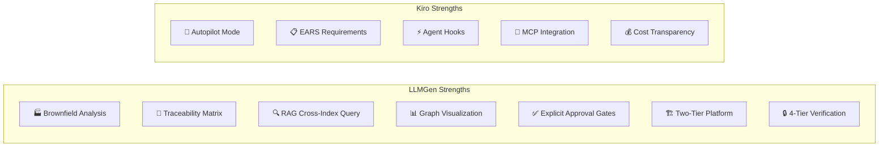
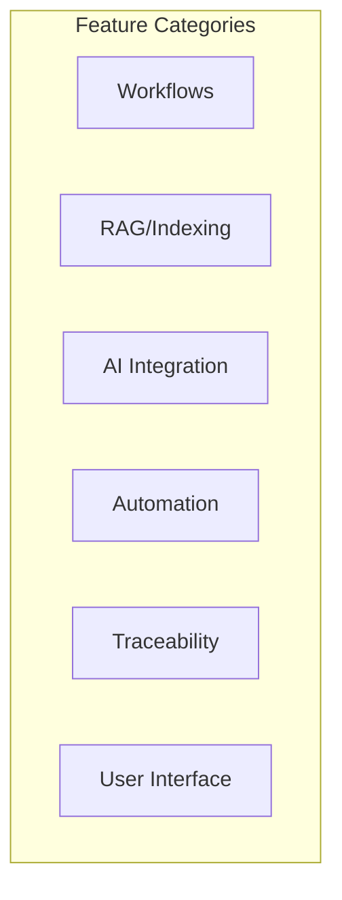
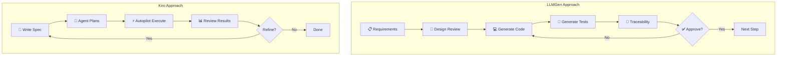
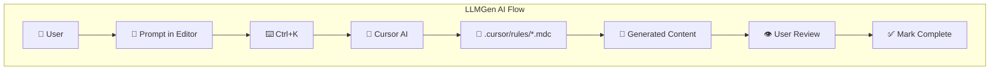
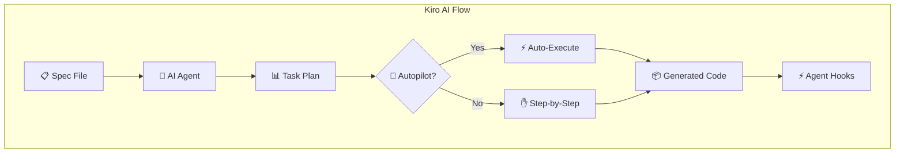
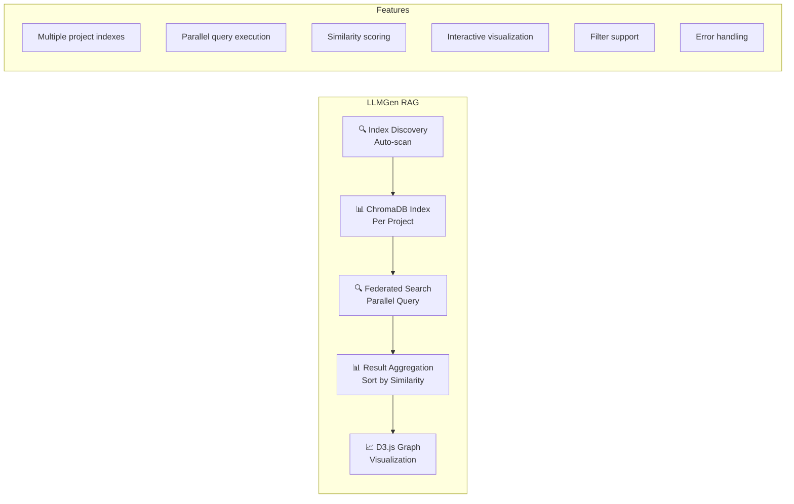
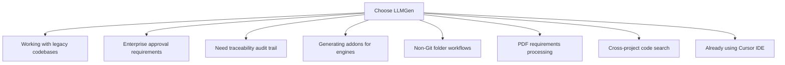
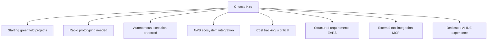

# LLMGen vs Amazon Kiro: Comprehensive Comparison

**Date:** 2026-05-29 
**Version:** 1.7.17 
**Purpose:** Feature comparison between LLMGen and Amazon Kiro IDE for AI-assisted development 
**Status:** Approved

---

## Executive Summary

This document provides a comprehensive comparison between **LLMGen** (VS Code/Cursor extension for LLM-assisted artifact generation) and **Amazon Kiro** (AWS's agentic AI IDE). Both tools represent the next generation of AI-assisted development, but serve different primary use cases and development philosophies.

**Key Finding:** LLMGen excels in **enterprise brownfield analysis** with explicit approval gates, while Kiro focuses on **autonomous agent-driven development** with autopilot capabilities.



---

## Tool Overview

### LLMGen Extension
| Aspect | Details |
|--------|---------|
| **Type** | Two-Tier: IDE Extension (VSIX) + Kubernetes Multi-Agentic Cluster (24 agents) |
| **Version** | 1.7.17 (Cursor) / 1.0.0 (VS Code) |
| **Philosophy** | Workflow-driven artifact generation with explicit approval gates |
| **Primary Focus** | Enterprise brownfield analysis, addon generation, traceability |
| **AI Integration** | Cursor (Ctrl+K), VS Code (vscode.lm API) |
| **Steering** | Cursor Rules (`.mdc` files) in `.cursor/rules/` |
| **Automation** | Cursor Hooks for event-driven actions |
| **Verification** | 4-tier: build+mocks → static analysis → real E2E → system DevOps E2E |
| **CI/CD** | Generates pipelines (Jenkins, ArgoCD, Crossplane, FluxCD) as artifacts |
| **Impact Analysis** | Traceability chain with extended graph visualization (v1.4.0) |
| **Repository** | Internal repository |

### Amazon Kiro IDE
| Aspect | Details |
|--------|---------|
| **Type** | Standalone IDE (VS Code fork) |
| **Version** | Preview (2025) |
| **Philosophy** | Spec-Driven Development with autonomous agents |
| **Primary Focus** | Greenfield development, rapid prototyping, autonomous execution |
| **AI Integration** | Claude (Anthropic) via AWS Bedrock |
| **Steering** | `.kiro/` directory with steering files |
| **Automation** | Native agent hooks (on_file_save, on_commit, etc.) |
| **Website** | https://kiro.dev |

---

## Feature Comparison Matrix


| Category | Feature | LLMGen | Kiro |
|----------|---------|--------|------|
| **Platform** | Platform Architecture | Two-Tier: Tier 1 IDE Extension + Tier 2 K8s Cluster (24 agents, custom templates, debug mode) | Single-tier IDE extension |
| | Token Efficiency | 40-55% reduction via step-segregated architecture; fresh context per step | Standard conversational prompts |
| **Workflows** | Greenfield Development | ✅ 4-step workflow (+ refine/interactive/agent modes) | ✅ Spec-driven |
| | Brownfield Analysis | ✅ 9-step workflow | ⚠️ Limited |
| | Addon Generation | ✅ 4-step workflow | ❌ Not supported |
| | Autopilot Mode | ❌ Not supported | ✅ Autonomous execution |
| **RAG/Indexing** | Vector Database | ✅ ChromaDB per project | ❌ Relies on context |
| | Multi-Collection Architecture | ✅ Four specialized collections with different embedding models (v1.6.12): `requirements` (all-MiniLM-L6-v2, 384d), `nfr` (all-mpnet-base-v2, 768d), `code` (all-mpnet-base-v2, 768d), `config` (all-MiniLM-L6-v2, 384d) | ❌ Not supported |
| | AST-Based Chunking | ✅ Structure-aware chunking for Python/TypeScript/Java/Go (v1.6.12) | ❌ Not supported |
| | YAML Resource-Level Chunking | ✅ Chunk K8s/Helm resources by kind + metadata.name + spec (v1.6.12) | ❌ Not supported |
| | Enhanced Metadata | ✅ Git metadata (repo_id, git_ref, commit) in all chunks (v1.6.12) | ❌ Not supported |
| | Workflow Restart Capability | ✅ Start new / restart current from webview completion banner (v1.6.12) | ❌ Not supported |
| | ID Conventions for Impact Analysis | ✅ Standardized ID formats (ACT-XXX, SC-XXX, FR-XXX, etc.) for consistent cross-project analysis (v1.6.12) | ❌ Not supported |
| | Dynamic Venv Discovery | ✅ Automatic Python virtual environment discovery for RAG queries (v1.6.12) | ❌ Not supported |
| | Cross-Index Query (Federated Search) | ✅ Parallel search across multiple indexes with result aggregation | ❌ Not supported |
| | Optimized Query Routing | ✅ Parallel queries across collections with intelligent routing (v1.6.6) | ❌ Not supported |
| | Graph Visualization | ✅ D3.js force-directed graph with pan/zoom/drag | ❌ Not supported |
| | Index Discovery | ✅ Auto-discovers indexes in brownfield-analysis/ recursively | ❌ Not supported |
| | Result Aggregation | ✅ Combines results from multiple indexes, sorted by similarity | ❌ Not supported |
| | Document Counting | ✅ Parallel execution with timeout per index | ❌ Not supported |
| | Filter Support | ✅ Language, chunkType, excludeTests, excludeGenerated, glob | ❌ Not supported |
| **AI Integration** | Multi-Model Support | ✅ Via Cursor | ✅ Claude, others |
| | Programmatic LLM | ✅ Both (Cursor + VS Code) | ✅ Native |
| | Interactive (Ctrl+K) | ✅ Cursor | ✅ Native |
| **Steering** | Rules/Config Files | ✅ `.cursor/rules/*.mdc` | ✅ `.kiro/steering.md` |
| | Project Standards | ✅ Via rules | ✅ Via steering |
| | Global vs Local | ✅ `alwaysApply` flag | ✅ Project/global |
| **Automation** | Agent Hooks | ✅ Cursor Hooks | ✅ Native hooks |
| | On File Save | ✅ | ✅ |
| | On Commit | ✅ | ✅ |
| | On Error | ✅ | ✅ |
| **Traceability** | Requirements Matrix | ✅ Req↔Design↔Code↔Tests | ⚠️ Implicit |
| | Gap Analysis | ✅ Built-in | ❌ Not explicit |
| | Coverage Reports | ✅ Built-in | ⚠️ Via specs |
| **Impact Analysis** | Traceability Chain | ✅ Input→Codebase→Code (v1.4.0) | ❌ Not supported |
| | Extended Graph | ✅ 6 node types, search/filter | ❌ Not supported |
| | Auto-Discovery | ✅ Finds traceability matrices | ❌ Not supported |
| | RAG Index Query | ✅ Queries ChromaDB index with filters | ❌ Not supported |
| | Hybrid Scoring | ✅ Vector + keyword + entity scoring | ❌ Not supported |
| | Requirements Parsing | ✅ UC, FR, NFR, AC extraction | ❌ Not supported |
| | Zero-Association Filter | ✅ Filter requirements with 0 impacts (v1.6.3) | ❌ Not supported |
| | Comprehensive Traceability | ✅ Always checks traceability even with 0 RAG hits (v1.6.3) | ❌ Not supported |
| | Requirement Strength Detection | ✅ Automatic detection of MUST/SHOULD/MAY/INFO (v1.6.4) | ❌ Not supported |
| | Three-Level Confidence | ✅ RAG/Traceability/Combined confidence scoring (v1.6.4) | ❌ Not supported |
| | Source Identification | ✅ Track RAG-only/Traceability-only/Both sources (v1.6.4) | ❌ Not supported |
| | Strength-Based Filtering | ✅ Filter by MUST/SHOULD/MAY/INFO (v1.6.4) | ❌ Not supported |
| | Statistics Dashboard | ✅ Real-time strength and source breakdown (v1.6.4) | ❌ Not supported |
| | Enhanced Traceability Search | ✅ Improved path matching with bidirectional search (v1.6.4) | ❌ Not supported |
| | Direct Traceability Search | ✅ Exhaustive search for requirements with no RAG hits (v1.6.3) | ❌ Not supported |
| | Enhanced Graph Filtering | ✅ Filters out requirements with 0 impacts unless traceability exists (v1.6.3) | ❌ Not supported |
| | Reranking | ✅ Cross-encoder reranking for better result ordering (v1.6.5) | ❌ Not supported |
| | Query Variants | ✅ Multiple query formulations per requirement (v1.6.5) | ❌ Not supported |
| | Enhanced Explainability | ✅ Confidence reasoning and score breakdown (v1.6.5) | ❌ Not supported |
| | Metadata Boost Scoring | ✅ Additional scoring signal for better alignment (v1.6.5) | ❌ Not supported |
| | File Path Resolution | ✅ Enhanced path resolution for graph "Open File" button (v1.6.6) | ❌ Not supported |
| **Requirements** | PDF Conversion | ✅ PDF→Markdown | ❌ Not supported |
| | Confluence Integration | ✅ CQL search, page selection, HTML→MD (v1.6.49) | ❌ Not supported |
| | JIRA Integration | ✅ JQL search, multi-select tickets (v1.6.49) | ❌ Not supported |
| | External Sources Dropdown | ✅ PDF/Folder/Confluence/JIRA (v1.6.49) | ❌ Not supported |
| | EARS Notation | ❌ Not supported | ✅ Structured format |
| **UI** | WebView Panels | ✅ Multiple | ✅ Integrated |
| | Tree Views | ✅ Projects, workflows | ✅ Tasks, specs |
| | Chat Interface | ✅ WebView/Participant | ✅ Native |
| | Analysis Portal (v1.6.3) | ✅ Unified dashboard | ❌ Not supported |
| | Documentation Viewer | ✅ Markdown + Mermaid | ❌ Not supported |
| | Reports Viewer | ✅ JSON + Markdown | ❌ Not supported |
| **Enterprise** | Verification Gates | 4-tier with explicit pass/fail KPIs (100% pass rate, 10 categories, 3 blocking gates per tier) | No verification tiers |
| | CI/CD Generation | Generates Jenkins, GitLab CI, GitHub Actions, ArgoCD, Crossplane, FluxCD as artifacts | Not supported |
| | Governance | Cursor Rules (.mdc) auto-injected via glob patterns; SDLC compliance compliance | Agent hooks for automation |
| | Approval Gates | ✅ Explicit step-by-step | ⚠️ Agent-driven |
| | Audit Trail | ✅ Full history | ⚠️ Limited |
| | Non-Git Support | ✅ Folder-based | ❌ Git-centric |
| | Source Analysis Reports | ✅ Automated report generation from analyzed codebases (v1.7.1) | ❌ Not supported |
| | Use Case Analysis | ✅ 5-step workflow (Analyze → Requirements → Design → Traceability → Gap Resolution) | ❌ Not supported |
| | E2E Testing | ✅ End-to-end test generation workflow with traceability | ❌ Not supported |
| | DevOps E2E | ✅ DevOps pipeline generation with CI/CD artifacts | ❌ Not supported |
| | Use Case Impact Analysis | ✅ Impact analysis scoped to individual use cases | ❌ Not supported |
| | Resume Workflows | ✅ Pause and resume any workflow from last completed step | ❌ Not supported |
| **Team Coordination (v1.7.17)** | CMS Coordination | ✅ Multi-developer: auto-sync, Team Dashboard, Teams/Email notifications, conflict detection | ❌ Not supported |
| | Multi-Developer CMS | ✅ codebase_status.yaml tracking, per-addon isolation, 3-attempt push retry, CMS orphan branch auto-creation, file ownership via `working_scope.yaml` + `_active_work.yaml` | ❌ Not supported |
| | Full Team View | ✅ Dashboard showing all developers, codebases, and addon status across repos | ❌ Not supported |
| | CMS Notifications | ✅ Teams and email notifications for CMS events | ❌ Not supported |
| | Multi-Codebase Support | ✅ Parallel work across codebases | ❌ Not supported |
| | Pre-Start Validation | ✅ Branch + up-to-date checks | ❌ Not supported |
| | Parallel Addon Development | ✅ Multiple devs, same codebase; isolated `codebase_status.yaml` per addon, source repo visibility via `metadata.yaml` fallback | ❌ Not supported |
| | Aggregated Dashboard | ✅ All codebases, all developers | ❌ Not supported |
| | Auto Branch Management | ✅ Create, push, PR offer | ❌ Not supported |
| **Telemetry** | Telemetry | ✅ Deployed (opt-in, local JSONL storage with redaction and retention) | ❌ Not supported |
| **Cost** | Transparency | ❌ Not built-in | ✅ Real-time display |
| | Usage Tracking | ❌ Not built-in | ✅ Per-prompt |

---

## Workflow Comparison

### Development Approach



### Greenfield Development
| Phase | LLMGen (4 Steps + optional modes) | Kiro (Spec-Driven) |
|-------|------------------|-------------------|
| **1. Upload Requirements** | Upload PDF/Confluence/JIRA/Folder requirements | Write spec.md |
| **2. Review Design** | Interactive design review with approval gates | Agent generates tech plan |
| **3. Generate Artifacts** | Generate code, tests, and CI/CD artifacts | Autopilot generates |
| **4. Track Consistency** | Traceability matrix and gap analysis | Acceptance criteria |
| **Optional** | Refine, interactive, and agent modes for iteration | Autopilot iteration |

### Brownfield Development
| Phase | LLMGen (9 Steps) | Kiro |
|-------|------------------|------|
| **1. Initialize** | Copy repository | Manual setup |
| **2. Index** | Build ChromaDB RAG | Context gathering |
| **3. Analyze** | Codebase analysis | Limited support |
| **4. Documentation** | Check existing docs | Not explicit |
| **5. Requirements** | Generate from code | Not supported |
| **6-9. Design/Trace** | Full workflow | Not supported |

**Key Difference:** LLMGen provides a **comprehensive 9-step brownfield workflow** specifically designed for legacy codebase analysis, while Kiro focuses primarily on greenfield development.

---

## AI Integration Comparison

### LLMGen AI Architecture



### Kiro AI Architecture



### Key Differences
| Aspect | LLMGen | Kiro |
|--------|--------|------|
| **Execution Model** | Interactive (Ctrl+K per step) | Autonomous (Autopilot) |
| **User Control** | High (explicit approval) | Variable (can be autonomous) |
| **AI Provider** | Cursor AI (Claude, GPT-4, etc.) | Claude via AWS Bedrock |
| **Context Management** | RAG + Rules | Steering files + Spec |

---

## Steering & Configuration

### LLMGen: Cursor Rules (`.mdc`)

```yaml
# .cursor/rules/project.instructions.mdc
---
description: Project-specific coding standards
globs: ["**/*.ts", "**/*.py"]
alwaysApply: false
---

## Architecture Patterns
- Use repository pattern for data access
- Follow hexagonal architecture

## Coding Standards
- Maximum file length: 500 lines
- Require JSDoc for public APIs
```

**Features:**
- Multiple rule files for different concerns
- Glob-based file targeting
- `alwaysApply` for global vs contextual activation
- Integrated with Cursor IDE natively

### Kiro: Steering Files

```markdown
# .kiro/steering.md

## Project Overview
This is a TypeScript microservice...

## Coding Standards
- Use strict TypeScript
- Follow functional patterns

## Architecture
- Repository pattern for data access
- Event-driven communication
```

**Features:**
- Single steering file per project
- Markdown format
- Read by agent before each task
- Supports global and project-level

---

## Automation & Hooks

### Comparison Table
| Hook Type | LLMGen (Cursor Hooks) | Kiro (Agent Hooks) |
|-----------|----------------------|-------------------|
| On File Save | ✅ Run linter, tests | ✅ Run validation |
| On Commit | ✅ Update docs, changelog | ✅ Generate summary |
| On File Create | ✅ Apply boilerplate | ✅ Check naming |
| On Error | ✅ Suggest fixes | ✅ Auto-diagnose |
| On PR | ⚠️ Via external tools | ✅ Native support |
| Pre-task | ❌ Not supported | ✅ Validate prerequisites |
| Post-task | ❌ Not supported | ✅ Update tracking |

### LLMGen Hooks Configuration

```json
// Cursor settings
{
 "cursor.hooks": {
 "onFileSave": {
 "patterns": ["*.ts"],
 "action": "lint"
 }
 }
}
```

### Kiro Hooks Configuration

```yaml
# .kiro/hooks.yaml
hooks:
 on_file_save:
 - action: "validate_types"
 patterns: ["*.ts"]
 on_commit:
 - action: "generate_changelog"
 on_error:
 - action: "suggest_fix"
```

---

## RAG & Indexing Comparison

### LLMGen RAG System with Federated Search



**LLMGen RAG Features:**
- ✅ ChromaDB vector database per project
- ✅ **Federated Search**: Cross-index parallel search across multiple projects
- ✅ **Index Discovery**: Automatically finds all indexes in `brownfield-analysis/` recursively
- ✅ **Document Counting**: Parallel execution of `count_index.py` with 20s timeout per index
- ✅ **Result Aggregation**: Combines results from multiple indexes, sorted by similarity score (highest first)
- ✅ **Multi-Select Query**: User selects one or multiple indexes to query simultaneously
- ✅ **Parallel Execution**: `Promise.all` with independent `query_index.py` processes
- ✅ Document count tracking with refresh capability
- ✅ Similarity percentage display per result
- ✅ Force-directed graph visualization (D3.js)
- ✅ Pan, zoom, drag interactions
- ✅ **Comprehensive Filter Support**: language, chunkType, excludeTests, excludeGenerated, glob patterns
- ✅ Graceful error handling - continues with other indexes if one fails
- ✅ Consistent infrastructure - same `query_index.py` script used by impact analysis

**Federated Search Process:**
1. Recursively discovers all ChromaDB indexes in `brownfield-analysis/`
2. Executes `count_index.py` in parallel for each index (with 20s timeout)
3. User selects indexes via checkboxes and enters query
4. User can optionally apply filters (language, chunkType, excludeTests, excludeGenerated, glob)
5. Executes `query_index.py` processes in parallel for each selected index (`Promise.all`)
6. Each query spawns independent process with same query text and filters
7. Results collected asynchronously (faster indexes complete first)
8. Aggregates results from all indexes into `CrossIndexResults` object
9. Sorts by similarity score (highest first) across all projects
10. Groups by project for organized display
11. Displays in graph visualization or list view

**Integration with Impact Analysis:**
- Impact analysis uses the same `query_index.py` script and parallel execution pattern as federated search
- Both systems support identical filter options (language, chunkType, excludeTests, excludeGenerated, glob patterns)
- Impact analysis can leverage federated search for cross-project impact assessment
- Impact analysis applies additional hybrid scoring (vector + keyword + entity) beyond federated search's similarity scoring
- Impact analysis builds traceability chains linking input requirements to codebase requirements to implementations
- Impact analysis executes multiple queries per requirement (main + sub-queries) in parallel, similar to federated search's multi-index query pattern

### Kiro Context Management

Kiro relies on AI agent's native context window rather than explicit RAG:

- ❌ No dedicated vector database
- ❌ No cross-project search
- ❌ No federated search capabilities
- ✅ Large context window (Claude)
- ✅ Spec-based context inclusion

---

## Unique Advantages

### LLMGen Unique Features
| # | Feature | Description | Business Value |
|---|---------|-------------|----------------|
| 1 | **9-Step Brownfield Workflow** | Comprehensive reverse-engineering process | Analyze legacy codebases systematically |
| 2 | **Addon Generation** | 4-step workflow for engine addons | Extend analyzed systems safely |
| 3 | **Traceability Matrix** | Req↔Design↔Code↔Tests links | Audit compliance, gap analysis |
| 4 | **ChromaDB RAG** | User-controlled vector indexes | Semantic search across codebases |
| 5 | **Cross-Index Query** | Search multiple projects at once | Find patterns across systems |
| 6 | **Graph Visualization** | D3.js force-directed graph | Visual exploration of results |
| 7 | **PDF Conversion** | PDF→Markdown requirements | Process existing documents |
| 8 | **Non-Git Support** | Works with folder-based codebases | Handle non-versioned code |
| 9 | **Explicit Approval** | Step-by-step manual confirmation | Enterprise governance |
| 10 | **Traceability Chain** | Input→Codebase→Implementation linking | End-to-end requirement tracking |
| 11 | **Extended Graph Nodes** | 6 node types (input-req, codebase-req, design, impl, file, entity) | Rich visualization |
| 12 | **Interactive Search/Filter** | Real-time filtering in graph visualization | Focus on specific requirements |
| 13 | **Federated Search** | Query multiple indexes in parallel with result aggregation, document counting, multi-select | Cross-project code exploration, pattern discovery |
| 14 | **Impact Analysis Process** | RAG queries + hybrid scoring + traceability chain building + parallel query execution | Comprehensive impact assessment with end-to-end traceability |
| 15 | **Requirements Parsing** | UC, FR, NFR, AC extraction from markdown with keyword/entity identification | Structured requirement analysis |
| 16 | **Parallel Query Execution** | Multiple queries per requirement executed in parallel (`Promise.all`) | Faster impact analysis for complex requirements |
| 17 | **Comprehensive Filtering** | Language, chunkType, excludeTests, excludeGenerated, glob patterns | Precise code search across projects |
| 18 | **Analysis Portal** | Unified dashboard for managing all analyses | Centralized access to workflows, documentation, reports |
| 19 | **Documentation Viewer** | Markdown + Mermaid diagram rendering | View storyboards with interactive diagrams |
| 20 | **Reports Viewer** | JSON and Markdown report viewing | View impact analysis reports with syntax highlighting |
| 21 | **Status Detection** | Accurate project status from storage + artifacts | Reliable status reporting for greenfield projects |
| 22 | **Open Folder Integration** | Open project folders in VS Code explorer | Quick access to project files |
| 23 | **Zero-Association Filter** | Filter requirements with 0 impacts via checkbox (v1.6.3) | Improved UX for large requirement sets |
| 24 | **Comprehensive Traceability Verification** | Always checks traceability even with 0 RAG hits (v1.6.3) | Ensures all requirements are verified against traceability matrix |
| 25 | **Direct Traceability Search** | Exhaustive keyword/text matching for requirements with no RAG hits (v1.6.3) | Finds traceability matches even without direct RAG evidence |
| 26 | **Enhanced Graph Filtering** | Filters out requirements with 0 impacts unless traceability exists (v1.6.3) | More meaningful graph visualization |
| 27 | **Two-Tier Platform** | Tier 1 IDE Extension + Tier 2 Kubernetes Multi-Agentic Cluster (24 agents, custom templates, debug mode) | Enterprise-scale generation; Kiro has no K8s cluster tier |
| 28 | **4-Tier Verification** | Build+mocks → static analysis → real E2E → system DevOps E2E with pass/fail KPIs (10 categories, 3 blocking gates per tier) | Quality gates ensure production readiness; Kiro has no verification tiers |
| 29 | **Token Efficiency** | 40-55% reduction via step-segregated architecture; fresh context per step eliminates conversational drift | Lower cost and higher accuracy; Kiro uses standard conversational prompts |

### Kiro Unique Features
| # | Feature | Description | Business Value |
|---|---------|-------------|----------------|
| 1 | **Autopilot Mode** | Autonomous multi-task execution | Hands-free development |
| 2 | **EARS Notation** | Structured requirements format | Testable, unambiguous specs |
| 3 | **Cost Transparency** | Real-time credit/token display | Budget management |
| 4 | **MCP Integration** | Model Context Protocol support | Jira, GitHub, DB connections |
| 5 | **Native Hooks** | Built-in agent automation | Seamless CI/CD integration |
| 6 | **Task Breakdown** | Auto-generated task files | Progress tracking |
| 7 | **Standalone IDE** | Purpose-built for AI development | Optimized experience |
| 8 | **AWS Integration** | Native Bedrock connection | Enterprise AWS workflows |

---

## When to Use Each Tool

### Choose LLMGen When:



**Best For:**
- 🏭 **Brownfield projects** requiring comprehensive analysis
- 🔗 **Compliance-heavy** environments needing traceability
- 🧩 **Addon/plugin development** for existing engines
- 📊 **Multi-project searches** across indexed codebases
- 📄 **PDF-based requirements** that need conversion

### Choose Kiro When:



**Best For:**
- 🌱 **Greenfield projects** from scratch
- 🚀 **Rapid prototyping** with autonomous agents
- ☁️ **AWS-centric** development workflows
- 💰 **Cost-conscious** teams needing usage tracking
- 🔌 **External integrations** (Jira, GitHub Issues)

---

## Integration Architecture Comparison

### LLMGen in Cursor

```
┌─────────────────────────────────────────────────────────────┐
│ Cursor IDE │
├─────────────────────────────────────────────────────────────┤
│ .cursor/rules/ │ Cursor Features │
│ ├── common.mdc │ ├── Ctrl+K Composer │
│ ├── project.mdc │ ├── Hooks (on save, etc.) │
│ └── *.instructions.mdc │ └── AI Chat │
├─────────────────────────────────────────────────────────────┤
│ LLMGen Extension v1.7.17 │
│ ├── Greenfield Workflow (4 steps + refine/interactive) │
│ ├── Brownfield Workflow (9 steps) │
│ ├── Addon Workflow (4 steps) │
│ ├── Use Case Workflow (5 steps) │
│ ├── E2E Testing / DevOps E2E Workflows │
│ ├── RAG Subsystem (ChromaDB + D3.js Graph) │
│ ├── Impact Analysis (Traceability Chain + Search/Filter) │
│ ├── CMS (Full Team View + Notifications) │
│ └── Traceability Dashboard │
├─────────────────────────────────────────────────────────────┤
│ External Tools │
│ ├── Python (pdf2md, indexer) │
│ ├── ChromaDB (vector storage) │
│ └── Git (version control) │
└─────────────────────────────────────────────────────────────┘
```

### Kiro Standalone

```
┌─────────────────────────────────────────────────────────────┐
│ Kiro IDE │
├─────────────────────────────────────────────────────────────┤
│ .kiro/ │ Native Features │
│ ├── steering.md │ ├── Autopilot Mode │
│ ├── spec.md │ ├── Agent Hooks │
│ ├── tech-plan.md │ ├── Cost Display │
│ └── tasks/ │ └── MCP Integration │
├─────────────────────────────────────────────────────────────┤
│ AI Agent (Claude) │
│ ├── Spec Parsing │
│ ├── Task Generation │
│ ├── Code Generation │
│ └── Autonomous Execution │
├─────────────────────────────────────────────────────────────┤
│ External Integrations (MCP) │
│ ├── Jira │
│ ├── GitHub Issues │
│ ├── Databases │
│ └── Custom APIs │
└─────────────────────────────────────────────────────────────┘
```

---

## Migration Considerations

### From Kiro to LLMGen

1. Convert `.kiro/spec.md` → LLMGen requirements format
2. Convert `.kiro/tech-plan.md` → Design documents
3. Convert `.kiro/tasks/` → Workflow steps
4. Set up `.cursor/rules/` with project standards
5. Build ChromaDB index from existing codebase
6. Configure Cursor Hooks to replace Kiro hooks

### From LLMGen to Kiro

1. Export requirements → `.kiro/spec.md` (EARS format)
2. Export design docs → `.kiro/tech-plan.md`
3. Create task breakdown in `.kiro/tasks/`
4. Convert `.cursor/rules/` → `.kiro/steering.md`
5. Configure MCP servers for integrations
6. Adapt to Autopilot workflow

---

## Conclusion
| Aspect | LLMGen | Kiro |
|--------|--------|------|
| **Primary Strength** | Brownfield analysis & traceability | Autonomous greenfield development |
| **Platform** | Two-Tier: IDE Extension + K8s Cluster (24 agents) | Single-tier IDE extension |
| **Governance Model** | Explicit approval gates + SDLC compliance compliance | Agent-driven autonomy |
| **Verification** | 4-tier with pass/fail KPIs and blocking gates | No verification tiers |
| **CI/CD** | Generates pipelines (Jenkins, ArgoCD, Crossplane, FluxCD) | Not supported |
| **Token Efficiency** | 40-55% reduction via step-segregated architecture | Standard conversational prompts |
| **Ecosystem** | Cursor/VS Code extension | Standalone IDE |
| **Enterprise Fit** | Strong (audit trails, compliance, quality gates) | Moderate (less explicit control) |
| **Developer Experience** | Guided step-by-step workflows | Spec-first autonomous execution |
| **RAG Capability** | Advanced (ChromaDB + Graph) | Basic (context window) |
| **Cost Visibility** | Not built-in | Real-time tracking |
| **AWS Integration** | Manual | Native (Bedrock) |

**Recommendation:**
- Use **LLMGen** for enterprise brownfield analysis, compliance-heavy projects, and addon development
- Use **Kiro** for greenfield rapid prototyping, autonomous development, and AWS-centric workflows
- Consider **hybrid approach**: Use LLMGen for analysis phase, Kiro for implementation

---

## References

### LLMGen Resources
- Architecture: `vscode_extension/design/architecture.md`
- User Guide: `vscode_extension/cursor/docs/USER_GUIDE.md`
- Deployment: `vscode_extension/cursor/docs/DEPLOYMENT_GUIDE.md`

### Kiro Resources
- **Kiro IDE**: https://kiro.dev
- **Kiro Documentation**: https://docs.kiro.dev
- **AWS Bedrock**: https://aws.amazon.com/bedrock/

### Related Standards
- **EARS Notation**: https://alistairmavin.com/ears/
- **Model Context Protocol**: https://modelcontextprotocol.io
- **Cursor Rules**: https://docs.cursor.com/context/rules-for-ai

### Related Documents
- `docs/llmgen-speckit-comparison.md` - Comparison with GitHub Spec-Kit
- `docs/llmgen-kiro-comparison-proposed-additions.md` - Feature roadmap
