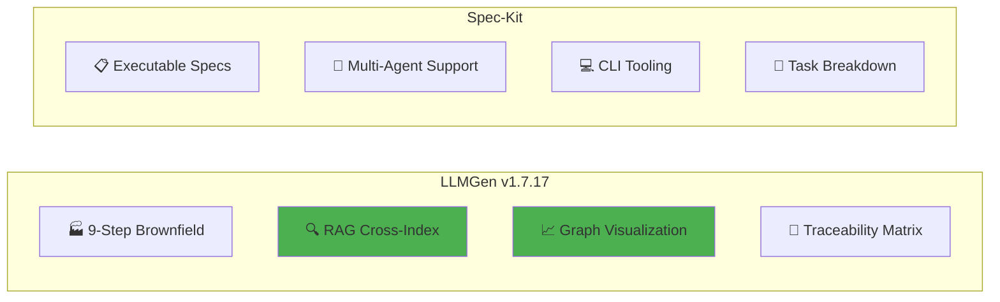
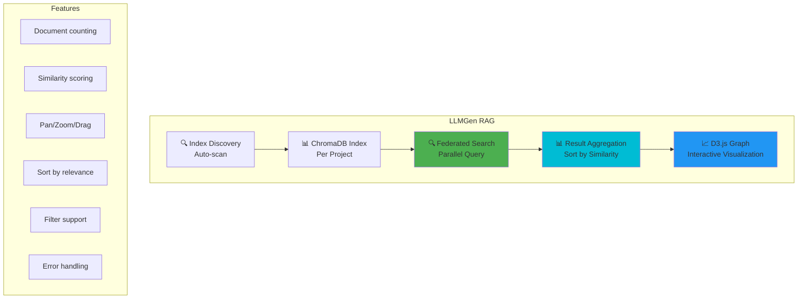

# LLMGen vs GitHub Spec-Kit: Comparative Analysis

**Date:** 2026-05-29 
**Version:** 1.7.17 
**Purpose:** Feature comparison between LLMGen and GitHub's Spec-Kit for specification-driven development 
**Status:** Approved

---

## Executive Summary

This document provides a comprehensive comparison between **LLMGen** (the VS Code/Cursor extension for LLM-assisted artifact generation) and **GitHub Spec-Kit** (GitHub's open-source toolkit for Spec-Driven Development). Both tools aim to transform how developers work with AI assistants, but take fundamentally different approaches.

**Key Finding:** LLMGen achieves feature parity with Spec-Kit in critical areas and exceeds it in others:
- **Steering Capabilities**: LLMGen uses Cursor Rules (`.mdc` files) vs Spec-Kit's steering files
- **Hooks/Automation**: LLMGen leverages Cursor's native hooks vs Spec-Kit's agent hooks
- **RAG Capabilities**: LLMGen provides ChromaDB indexing with graph visualization (Spec-Kit lacks this)
- **Workflow Structure**: Both support greenfield and brownfield development



---

## Tool Overview

### LLMGen v1.7.17
| Aspect | Details |
|--------|---------|
| **Type** | VS Code/Cursor Extension + Kubernetes Multi-Agentic Cluster |
| **Verification** | 4-tier quality gates (build → static analysis → E2E → system E2E) |
| **Philosophy** | Workflow-driven artifact generation with explicit approval gates |
| **Primary Focus** | Enterprise-grade brownfield analysis, addon generation, traceability |
| **AI Integration** | Works with any LLM via Cursor (Claude, GPT-4, etc.) |
| **Steering** | Cursor Rules (`.mdc` files) in `.cursor/rules/` |
| **Automation** | Cursor Hooks for event-driven actions |
| **RAG** | ChromaDB with cross-index query and D3.js graph visualization |
| **Impact Analysis** | Traceability chain with extended graph and search/filter UI (v1.4.0) |

### GitHub Spec-Kit
| Aspect | Details |
|--------|---------|
| **Type** | CLI Toolkit + Templates |
| **Philosophy** | Specification-Driven Development (SDD) - specs become executable |
| **Primary Focus** | Greenfield development, creative exploration, AI agent orchestration |
| **AI Integration** | Claude Code, GitHub Copilot, Cursor, Gemini CLI |
| **Steering** | `.spec/` directory with structured spec files |
| **Automation** | Built-in agent hooks and task automation |
| **RAG** | Relies on AI agent context (no dedicated indexing) |

---

## Feature Comparison Matrix
| Category | LLMGen v1.7.17 | GitHub Spec-Kit |
|----------|---------------|-----------------|
| **Platform Architecture** | Two-Tier: IDE Extension + K8s Cluster (24 agents, template builder, debug mode) | CLI Toolkit (single-tier) |
| **Verification Gates** | 4-tier with 100% pass rate requirement | No verification tiers |
| **Token Efficiency** | 40-55% reduction via step isolation | Standard prompt patterns |
| **CI/CD Generation** | Generates Jenkins, ArgoCD, Crossplane, FluxCD | CLI-based task automation |
| **CMS Coordination** | Multi-developer with Team Dashboard + notifications | No team coordination |
| **Development Approach** | Workflow-driven (steps, gates, approvals) | Spec-driven (intent → implementation) |
| **Steering Files** | ✅ `.cursor/rules/*.mdc` files | ✅ `.spec/` directory structure |
| **Agent Hooks** | ✅ Cursor Hooks (on save, on commit, etc.) | ✅ Native agent hooks |
| **Greenfield Support** | ✅ 4-step workflow | ✅ "0-to-1 Development" phase |
| **Brownfield Support** | ✅ 9-step analysis workflow | ⚠️ "Iterative Enhancement" phase (limited) |
| **Addon Generation** | ✅ 4-step dedicated workflow | ❌ No explicit addon concept |
| **Traceability Matrix** | ✅ Requirements ↔ Design ↔ Code ↔ Tests | ❌ Not explicit |
| **RAG/Indexing** | ✅ ChromaDB with cross-index query | ❌ Relies on AI agent context |
| **Graph Visualization** | ✅ D3.js force-directed graph | ❌ Not supported |
| **Impact Analysis** | ✅ Traceability chain with search/filter (v1.4.0) | ❌ Not supported |
| | Zero-Association Filter | ✅ Filter requirements with 0 impacts (v1.6.3) | ❌ Not supported |
| | Comprehensive Traceability | ✅ Always checks traceability even with 0 RAG hits (v1.6.3) | ❌ Not supported |
| | Direct Traceability Search | ✅ Exhaustive search for requirements with no RAG hits (v1.6.3) | ❌ Not supported |
| | Enhanced Graph Filtering | ✅ Filters out requirements with 0 impacts unless traceability exists (v1.6.3) | ❌ Not supported |
| | Requirement Strength Detection | ✅ Automatic detection of MUST/SHOULD/MAY/INFO (v1.6.4) | ❌ Not supported |
| | Three-Level Confidence | ✅ RAG/Traceability/Combined confidence scoring (v1.6.4) | ❌ Not supported |
| | Source Identification | ✅ Track RAG-only/Traceability-only/Both sources (v1.6.4) | ❌ Not supported |
| | Strength-Based Filtering | ✅ Filter by MUST/SHOULD/MAY/INFO (v1.6.4) | ❌ Not supported |
| | Statistics Dashboard | ✅ Real-time strength and source breakdown (v1.6.4) | ❌ Not supported |
| | Enhanced Traceability Search | ✅ Improved path matching with bidirectional search (v1.6.4) | ❌ Not supported |
| | Reranking | ✅ Cross-encoder reranking for better result ordering (v1.6.5) | ❌ Not supported |
| | Query Variants | ✅ Multiple query formulations per requirement (v1.6.5) | ❌ Not supported |
| | Enhanced Explainability | ✅ Confidence reasoning and score breakdown (v1.6.5) | ❌ Not supported |
| | Metadata Boost Scoring | ✅ Additional scoring signal for better alignment (v1.6.5) | ❌ Not supported |
| | File Path Resolution | ✅ Enhanced path resolution for graph "Open File" button (v1.6.6) | ❌ Not supported |
| | Multi-Collection RAG Index | ✅ Four specialized collections with different embedding models (v1.6.12): `requirements` (all-MiniLM-L6-v2, 384d), `nfr` (all-mpnet-base-v2, 768d), `code` (all-mpnet-base-v2, 768d), `config` (all-MiniLM-L6-v2, 384d) | ❌ Not supported |
| | AST-Based Chunking | ✅ Structure-aware chunking for Python/TypeScript/Java/Go (v1.6.12) | ❌ Not supported |
| | YAML Resource-Level Chunking | ✅ Chunk K8s/Helm resources by kind + metadata.name + spec (v1.6.12) | ❌ Not supported |
| | Enhanced Metadata | ✅ Git metadata (repo_id, git_ref, commit) in all chunks (v1.6.12) | ❌ Not supported |
| | Optimized Query Routing | ✅ Parallel queries across collections with intelligent routing (v1.6.12) | ❌ Not supported |
| | Increased Timeouts | ✅ 120s for impact analysis, 90s for federated/webview queries (v1.6.12) | ❌ Not supported |
| | Workflow Restart Capability | ✅ Start new / restart current from webview completion banner (v1.6.12) | ❌ Not supported |
| | ID Conventions for Impact Analysis | ✅ Standardized ID formats for consistent cross-project analysis (v1.6.12) | ❌ Not supported |
| | Dynamic Venv Discovery | ✅ Automatic Python venv discovery for RAG queries (v1.6.12) | ❌ Not supported |
| **Analysis Portal** | ✅ Unified dashboard (v1.6.3) | ❌ Not supported |
| **Documentation Viewer** | ✅ Markdown + Mermaid (v1.6.3) | ❌ Not supported |
| **Reports Viewer** | ✅ JSON + Markdown (v1.6.3) | ❌ Not supported |
| **Extended Graph Types** | ✅ 6 node types (input-req, codebase-req, design, impl) | ❌ Not supported |
| **Non-Git Merge** | ✅ Supports codebase folders without `.git` | ❌ Git-centric |
| **PDF Conversion** | ✅ PDF → Markdown requirements | ❌ Not supported |
| **Confluence Integration** | ✅ CQL search, page selection, HTML→MD (v1.6.49) | ❌ Not supported |
| **JIRA Integration** | ✅ JQL search, multi-select tickets (v1.6.49) | ❌ Not supported |
| **External Requirements Sources** | ✅ PDF/Folder/Confluence/JIRA dropdown (v1.6.49) | ❌ Not supported |
| **Multi-Agent Support** | ✅ Via Cursor (any model) | ✅ Claude, Copilot, Gemini, etc. |
| **CLI Interface** | ⚠️ Partial (Confluence/JIRA CLIs via cliIntegration utility) | ✅ `specify` CLI tool |
| **Template System** | ✅ Parameterized prompts `{{PARAM}}` | ✅ Structured spec templates |
| **Approval Workflow** | ✅ Explicit step-by-step approval | ⚠️ Agent-driven, less explicit |
| **Cost Transparency** | ❌ Not built-in | ❌ Not built-in |
| **Multimodal Input** | ❌ Text-based | ⚠️ Depends on AI agent |
| **Team Coordination (v1.7.1)** | | |
| - Multi-Developer CMS | ✅ codebase_status.yaml tracking, per-addon isolation, 3-attempt push retry, CMS orphan branch auto-creation, file ownership via `working_scope.yaml` + `_active_work.yaml` | ❌ Not supported |
| - Multi-Codebase Support | ✅ Parallel work across codebases | ❌ Not supported |
| - Pre-Start Validation | ✅ Branch + up-to-date checks | ❌ Not supported |
| - Parallel Addon Development | ✅ Multiple devs, same codebase; isolated `codebase_status.yaml` per addon, source repo visibility via `metadata.yaml` fallback | ❌ Not supported |
| - Aggregated Dashboard | ✅ All codebases, all developers | ❌ Not supported |
| - Auto Branch Management | ✅ Create, push, PR offer | ❌ Not supported |
| **Use Case Analysis** | ✅ 5-step high-level design from business requirements | ❌ Not supported |
| **E2E Testing** | ✅ Test generation against real deployed services | ❌ Not supported |
| **DevOps Entire E2E** | ✅ Multi-project system deployment and testing | ❌ Not supported |
| **Use Case Impact Analysis** | ✅ Impact analysis scoped to use case requirements | ❌ Not supported |
| **Resume Workflows** | ✅ Pause/resume any workflow across sessions via CMS | ❌ Not supported |
| **Source Analysis Reports** | ✅ Aggregated reports from analyzed artifacts (no LLM cost) | ❌ Not supported |
| **Telemetry** | ✅ Opt-in local JSONL with redaction and retention (v1.7.17) | ❌ Not supported |

---

## Steering Capabilities Comparison

### LLMGen: Cursor Rules (`.mdc` Files)

LLMGen leverages Cursor's native rule system for AI behavior steering:

```yaml
# .cursor/rules/project.instructions.mdc
---
description: Project-specific coding standards
globs: ["**/*.ts", "**/*.py"]
alwaysApply: false
---

## Architecture Patterns
- Use repository pattern for data access
- Follow hexagonal architecture
- Implement CQRS for complex domains

## Coding Standards
- Maximum file length: 500 lines
- Require JSDoc for public APIs
- Use strict TypeScript settings
```

**Advantages:**
- Integrated into Cursor IDE natively
- Glob-based file targeting
- `alwaysApply` for global vs contextual rules
- Multiple rule files for different concerns
- Referenced by LLMGen during artifact generation

### Spec-Kit: Specification Files

Spec-Kit uses a structured `.spec/` directory:

```
.spec/
├── spec.md # Main product specification
├── tech-plan.md # Technical implementation plan
├── tasks/ # Task breakdown
│ ├── task-001.md
│ └── task-002.md
└── templates/ # Reusable templates
```

**Advantages:**
- Clear separation of concerns
- Built-in task management
- Structured refinement workflow
- Agent-agnostic approach

---

## Hooks & Automation Comparison

### LLMGen: Cursor Hooks

LLMGen uses Cursor's native hooks system for event-driven automation:
| Hook Type | LLMGen Support | Example Use Case |
|-----------|----------------|------------------|
| `onFileSave` | ✅ | Run linter, update tests |
| `onCommit` | ✅ | Generate changelog, update docs |
| `onFileCreate` | ✅ | Apply boilerplate, check naming |
| `onError` | ✅ | Auto-suggest fixes |
| `onPR` | ⚠️ Via external tools | Security scan, code review |

### Spec-Kit: Agent Hooks

Spec-Kit provides built-in agent hooks:
| Hook Type | Spec-Kit Support | Example Use Case |
|-----------|------------------|------------------|
| Pre-task | ✅ | Validate prerequisites |
| Post-task | ✅ | Update tracking, notify |
| On-failure | ✅ | Rollback, retry logic |
| On-completion | ✅ | Generate summary |

---

## RAG Capabilities Comparison

### LLMGen RAG System with Federated Search (v1.4.0)



**LLMGen RAG Features:**
- ✅ ChromaDB vector database per project
- ✅ **Federated Search**: Cross-index parallel search across multiple projects
- ✅ **Index Discovery**: Automatically finds all indexes in `brownfield-analysis/` recursively
- ✅ **Document Counting**: Parallel execution of `count_index.py` with 20s timeout per index
- ✅ **Result Aggregation**: Combines results from multiple indexes, sorted by similarity score (highest first)
- ✅ **Multi-Select Query**: User selects one or multiple indexes to query simultaneously
- ✅ **Parallel Execution**: `Promise.all` with independent `query_index.py` processes
- ✅ Document count display for each index with refresh capability
- ✅ Similarity percentage scoring per result
- ✅ D3.js force-directed graph visualization
- ✅ Interactive pan, zoom, drag controls
- ✅ Refresh indexes to update counts and re-discover indexes
- ✅ Sort results by similarity across all projects
- ✅ **Comprehensive Filter Support**: language, chunkType, excludeTests, excludeGenerated, glob patterns
- ✅ Graceful error handling - continues with other indexes if one fails
- ✅ Consistent infrastructure - same `query_index.py` script used by impact analysis

**Federated Search Process:**
1. Recursively discovers all ChromaDB indexes in `brownfield-analysis/`
2. Executes `count_index.py` in parallel for each index (with 20s timeout)
3. User selects indexes via checkboxes and enters query
4. User can optionally apply filters (language, chunkType, excludeTests, excludeGenerated, glob)
5. Executes `query_index.py` processes in parallel for each selected index (`Promise.all`)
6. Each query spawns independent process with same query text and filters
7. Results collected asynchronously (faster indexes complete first)
8. Aggregates results from all indexes into `CrossIndexResults` object
9. Sorts by similarity score (highest first) across all projects
10. Groups by project for organized display
11. Displays in graph visualization or list view

**Integration with Impact Analysis:**
- Impact analysis uses the same `query_index.py` script and parallel execution pattern as federated search
- Both systems support identical filter options (language, chunkType, excludeTests, excludeGenerated, glob patterns)
- Impact analysis can leverage federated search for cross-project impact assessment
- Impact analysis applies additional hybrid scoring (vector + keyword + entity) beyond federated search's similarity scoring
- Impact analysis builds traceability chains linking input requirements to codebase requirements to implementations
- Impact analysis executes multiple queries per requirement (main + sub-queries) in parallel, similar to federated search's multi-index query pattern

### Spec-Kit Context Management

Spec-Kit relies on AI agent's native context window:
- ❌ No dedicated vector database
- ❌ No cross-project search
- ❌ No federated search capabilities
- ❌ No visualization
- ✅ Uses specification files as context
- ⚠️ Limited to model context window size

---

## Development Workflow Comparison

### Greenfield Development
| Phase | LLMGen (4 Steps) | Spec-Kit (SDD) |
|-------|------------------|----------------|
| **1. Upload Requirements** | Upload PDF → Markdown conversion | Spec Creation (spec.md) |
| **2. Review Design** | Design decisions WebView with prompt generation | Technical Planning (tech-plan.md) |
| **3. Generate Artifacts** | Design, code, tests, CI/CD via Cursor AI prompts | Task Breakdown → Implementation |
| **4. Track Consistency** | Traceability matrix and consistency report | (Not explicit) |

### Brownfield Development
| Phase | LLMGen (9 Steps) | Spec-Kit |
|-------|------------------|----------|
| **1. Initialize** | Copy repository | Manual setup |
| **2. Index** | Build ChromaDB RAG | Context gathering |
| **3. Analyze** | Codebase analysis | Architecture review |
| **4. Documentation** | Check existing docs | Documentation audit |
| **5. Requirements** | Generate requirements | Spec creation |
| **6. Align** | Align with goals | - |
| **7. Update** | Finalize requirements | - |
| **8. Design** | Generate design docs | Tech plan |
| **9. Traceability** | Create matrix | (Not explicit) |

---

## LLMGen Unique Advantages vs Spec-Kit
| # | LLMGen Feature | Description | Why Spec-Kit Lacks It |
|---|----------------|-------------|----------------------|
| **1** | **9-Step Brownfield Workflow** | Comprehensive reverse-engineering process with explicit phases | Spec-Kit focuses on forward development, not legacy analysis |
| **2** | **Dedicated Addon Generation** | 4-phase workflow for generating addons to existing engines | Spec-Kit has no "addon" concept - everything is a task |
| **3** | **Traceability Matrix** | Explicit Requirements ↔ Design ↔ Code ↔ Tests linking | Spec-Kit doesn't track cross-phase relationships |
| **4** | **Non-Git Merge Support** | Merge to codebase folders without `.git` requirement | Spec-Kit assumes Git-based workflows |
| **5** | **ChromaDB RAG Indexing** | User-controlled vector index with document counts | Spec-Kit relies on AI agent's native context handling |
| **6** | **Cross-Index Query (Federated Search)** | Search across multiple project indexes in parallel with result aggregation | Spec-Kit has no multi-project search |
| **7** | **Graph Visualization** | D3.js force-directed graph with pan/zoom/drag | Spec-Kit has no visual exploration |
| **8** | **PDF Requirements Conversion** | Built-in PDF → Markdown via Python bridge | Spec-Kit requires manual document preparation |
| **9** | **Design Decision Audit** | WebView for capturing architecture decisions | Spec-Kit doesn't track decision rationale explicitly |
| **10** | **Step Approval Gates** | Explicit `/next` progression with manual approval | Spec-Kit's agent-driven approach is more autonomous |
| **11** | **Traceability Chain** | Input→Codebase→Implementation linking (v1.4.0) | Spec-Kit has no cross-level tracing |
| **12** | **Extended Graph Nodes** | 6 node types for rich visualization | Spec-Kit has no visualization |
| **13** | **Interactive Search/Filter** | Real-time filtering in graph UI | Spec-Kit has no interactive exploration |
| **14** | **Parallel Query Execution** | Multiple queries per requirement executed in parallel (`Promise.all`) | Spec-Kit has no parallel query capability |
| **15** | **Document Counting** | Parallel execution with timeout per index | Spec-Kit has no index statistics |
| **16** | **Comprehensive Filtering** | Language, chunkType, excludeTests, excludeGenerated, glob patterns | Spec-Kit has no advanced filtering |
| **17** | **Impact Analysis Process** | RAG queries + hybrid scoring + traceability chain + parallel execution | Spec-Kit has no impact analysis |
| **18** | **Analysis Portal** | Unified dashboard for managing all analyses | Spec-Kit has no centralized dashboard |
| **19** | **Documentation Viewer** | Markdown + Mermaid diagram rendering | Spec-Kit has no documentation viewer |
| **20** | **Reports Viewer** | JSON and Markdown report viewing | Spec-Kit has no reports viewer |
| **21** | **Status Detection** | Accurate project status from storage + artifacts | Spec-Kit has no status tracking |
| **22** | **Open Folder Integration** | Open project folders in VS Code explorer | Spec-Kit has no folder integration |
| **23** | **Zero-Association Filter** | Filter requirements with 0 impacts via checkbox (v1.6.3) | Spec-Kit has no impact analysis |
| **24** | **Comprehensive Traceability Verification** | Always checks traceability even with 0 RAG hits (v1.6.3) | Spec-Kit has no impact analysis |
| **25** | **Direct Traceability Search** | Exhaustive keyword/text matching for requirements with no RAG hits (v1.6.3) | Spec-Kit has no impact analysis |
| **26** | **Enhanced Graph Filtering** | Filters out requirements with 0 impacts unless traceability exists (v1.6.3) | Spec-Kit has no impact analysis |

---

## Spec-Kit Unique Advantages vs LLMGen
| # | Spec-Kit Feature | Description | LLMGen Comparison |
|---|------------------|-------------|-------------------|
| **1** | **Executable Specifications** | Specs directly generate working code | LLMGen uses parameterized prompts, less direct |
| **2** | **Multi-Agent Support** | Works with Claude, Copilot, Gemini, Cursor | LLMGen tied to Cursor/VS Code ecosystem |
| **3** | **CLI Tool (`specify`)** | Command-line bootstrapping and management | LLMGen has partial CLI (Confluence/JIRA CLIs via cliIntegration) |
| **4** | **Official GitHub Support** | Backed by GitHub, integrated ecosystem | LLMGen is independent project |
| **5** | **Structured Task Breakdown** | Built-in task management in `.spec/tasks/` | LLMGen uses folder-based organization |
| **6** | **Agent-Agnostic Design** | Works across multiple AI environments | LLMGen optimized for Cursor/VS Code |
| **7** | **Creative Exploration Phase** | Explicit phase for rapid prototyping | LLMGen workflows are more structured |
| **8** | **Community Templates** | Growing library of spec templates | LLMGen prompts are project-specific |

---

## Feature Parity Analysis

```
✅ LLMGen Has (v1.7.17) | ✅ Spec-Kit Has | 🔄 Both Have
----------------------------------|---------------------------|--------------------
Steering via .mdc rules | Steering via .spec/ | AI agent integration
Hooks via Cursor Hooks | Native agent hooks | Greenfield workflows
Cross-index RAG query | Multi-agent flexibility | Template systems
D3.js graph visualization | CLI tooling | Code generation
9-step brownfield workflow | Executable specs | Context management
Traceability matrix | Task breakdown |
Addon generation | GitHub backing |
PDF→MD conversion | Community templates |
```

---

## Integration Architecture

### LLMGen with Cursor

```
┌─────────────────────────────────────────────────────────────┐
│ Cursor IDE │
├─────────────────────────────────────────────────────────────┤
│ .cursor/rules/ │ Cursor Hooks │
│ ├── project.mdc │ ├── onFileSave │
│ ├── python-coding.mdc │ ├── onCommit │
│ └── typescript.mdc │ └── onError │
├─────────────────────────────────────────────────────────────┤
│ LLMGen Extension v1.7.17 │
│ ├── Greenfield Workflow (4 steps) │
│ ├── Brownfield Workflow (9 steps) │
│ ├── Addon Workflow (4 steps) │
│ ├── RAG Subsystem (ChromaDB + Cross-Index + D3.js Graph) │
│ ├── Impact Analysis (Traceability Chain + Search/Filter) │
│ └── Traceability Dashboard │
├─────────────────────────────────────────────────────────────┤
│ External Tools │
│ ├── Python (pdf2md, indexer, query) │
│ ├── ChromaDB (vector storage) │
│ └── D3.js (graph visualization) │
└─────────────────────────────────────────────────────────────┘
```

### Spec-Kit Architecture

```
┌─────────────────────────────────────────────────────────────┐
│ .spec/ Directory │
├─────────────────────────────────────────────────────────────┤
│ spec.md │ Product specification │
│ tech-plan.md │ Technical implementation │
│ tasks/ │ Task breakdown │
│ templates/ │ Reusable templates │
├─────────────────────────────────────────────────────────────┤
│ AI Agents (Choose One) │
│ ├── Claude Code │
│ ├── GitHub Copilot │
│ ├── Cursor │
│ └── Gemini CLI │
├─────────────────────────────────────────────────────────────┤
│ specify CLI │
│ └── Bootstrap, manage, execute specs │
└─────────────────────────────────────────────────────────────┘
```

---

## When to Use Each Tool

### Choose LLMGen When:

1. **Working with legacy codebases** that need comprehensive analysis
2. **Enterprise environments** requiring explicit approval gates and audit trails
3. **Generating addons** for existing analyzed engines
4. **Traceability is critical** (Requirements ↔ Design ↔ Code ↔ Tests)
5. **Non-Git workflows** are required (codebase folders without `.git`)
6. **PDF requirements** need to be converted and processed
7. **Cross-project code search** is needed (RAG across indexes)
8. **Visual exploration** of search results (graph view)
9. **Already using Cursor** as primary IDE

### Choose Spec-Kit When:

1. **Starting greenfield projects** from scratch
2. **Rapid prototyping** and creative exploration
3. **Multi-agent flexibility** is needed (not tied to one IDE)
4. **CLI-based workflows** are preferred
5. **GitHub ecosystem integration** is important
6. **Community templates** would accelerate development
7. **Agent-agnostic approach** is required

---

## Migration Considerations

### From Spec-Kit to LLMGen

1. Convert `.spec/spec.md` → LLMGen requirements format
2. Map `.spec/tech-plan.md` → Design documents
3. Convert `.spec/tasks/` → Workflow steps
4. Set up `.cursor/rules/` with project standards
5. Build ChromaDB index from existing codebase
6. Use cross-index query to explore code

### From LLMGen to Spec-Kit

1. Export requirements → `.spec/spec.md`
2. Export design docs → `.spec/tech-plan.md`
3. Create task breakdown in `.spec/tasks/`
4. Configure preferred AI agent
5. Run `specify init` to bootstrap

---

## Conclusion

Both LLMGen and GitHub Spec-Kit represent sophisticated approaches to AI-assisted development, but serve different primary use cases:
| Aspect | LLMGen v1.7.17 | Spec-Kit |
|--------|---------------|----------|
| **Primary Strength** | Brownfield analysis, federated RAG search, traceability chain & addon generation | Greenfield spec-driven development |
| **Governance Model** | Explicit approval gates | Agent-driven autonomy |
| **Ecosystem** | Cursor-integrated with RAG + Impact Analysis | Multi-agent, agent-agnostic |
| **Enterprise Fit** | Strong (audit trails, traceability chain, federated search) | Moderate (less explicit controls) |
| **Developer Experience** | Guided workflows with visual exploration + search/filter | Specification-first freedom |
| **RAG Capability** | Advanced (federated search + cross-index + extended graph + search/filter) | None (context window only) |
| **Impact Analysis** | Full traceability chain (Input→Codebase→Code) with RAG queries + hybrid scoring | None |
| **Federated Search** | Parallel query across multiple indexes with result aggregation | None |

**LLMGen's competitive position has strengthened significantly through v1.7.17** with:
- ✅ Cursor Rules (`.mdc`) for steering - matching Spec-Kit's steering capabilities
- ✅ Cursor Hooks for automation - matching Spec-Kit's agent hooks
- ✅ **Federated Search** - **exceeding** Spec-Kit (parallel query across multiple indexes, result aggregation, document counting, multi-select)
- ✅ Cross-index RAG query - **exceeding** Spec-Kit (no equivalent)
- ✅ D3.js graph visualization - **exceeding** Spec-Kit (no equivalent)
- ✅ **Impact Analysis Process** (v1.4.0) - **exceeding** Spec-Kit (RAG queries + hybrid scoring + traceability chain + parallel execution)
- ✅ **Traceability Chain** (v1.4.0) - **exceeding** Spec-Kit (end-to-end requirement tracking)
- ✅ **Extended Graph Nodes** (v1.4.0) - **exceeding** Spec-Kit (6 node types for rich visualization)
- ✅ **Interactive Search/Filter** (v1.4.0) - **exceeding** Spec-Kit (real-time filtering)
- ✅ **Requirements Parsing** (v1.4.0) - **exceeding** Spec-Kit (UC, FR, NFR, AC extraction)
- ✅ **Parallel Query Execution** (v1.4.0) - **exceeding** Spec-Kit (multiple queries per requirement executed in parallel)
- ✅ **Comprehensive Filtering** (v1.4.0) - **exceeding** Spec-Kit (language, chunkType, excludeTests, excludeGenerated, glob patterns)
- ✅ **Zero-Association Filter** (v1.6.3) - **exceeding** Spec-Kit (filter requirements with 0 impacts)
- ✅ **Comprehensive Traceability Verification** (v1.6.3) - **exceeding** Spec-Kit (always checks traceability even with 0 RAG hits)
- ✅ **Direct Traceability Search** (v1.6.3) - **exceeding** Spec-Kit (exhaustive search for requirements with no RAG hits)
- ✅ **Enhanced Graph Filtering** (v1.6.3) - **exceeding** Spec-Kit (filters out requirements with 0 impacts unless traceability exists)
- ✅ **Phase 0 Improvements** (v1.6.5) - **exceeding** Spec-Kit (reranking, query variants, enhanced explainability, metadata boosts)
- ✅ **File Path Resolution Fix** (v1.6.6) - **exceeding** Spec-Kit (enhanced path resolution for graph file opening)
- ✅ Maintained unique advantages in brownfield analysis, addon generation, and enterprise features

---

## References

- **Spec-Kit Documentation**: https://github.github.com/spec-kit/
- **Spec-Kit GitHub Repository**: https://github.com/github/spec-kit
- **SpecKit.org**: https://speckit.org/
- **Cursor Rules Documentation**: https://docs.cursor.com/context/rules-for-ai
- **LLMGen Extension**: `vscode_extension/cursor/`
- **LLMGen Architecture**: `vscode_extension/design/architecture.md`
- **Related Comparison**: `docs/llmgen-kiro-comparison.md`
