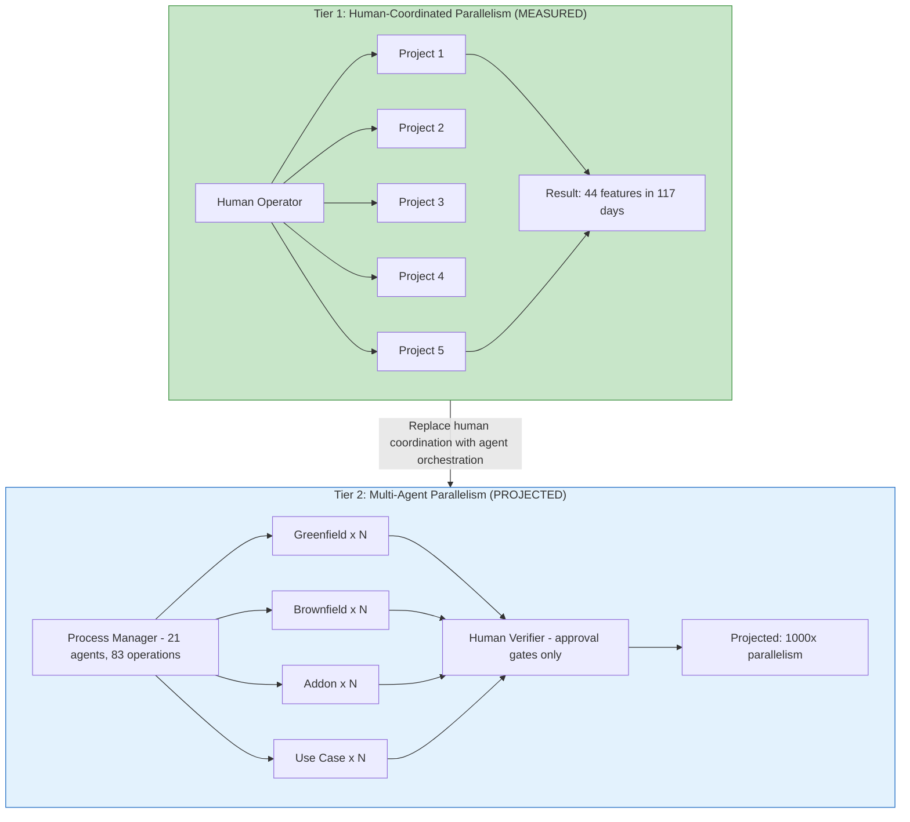
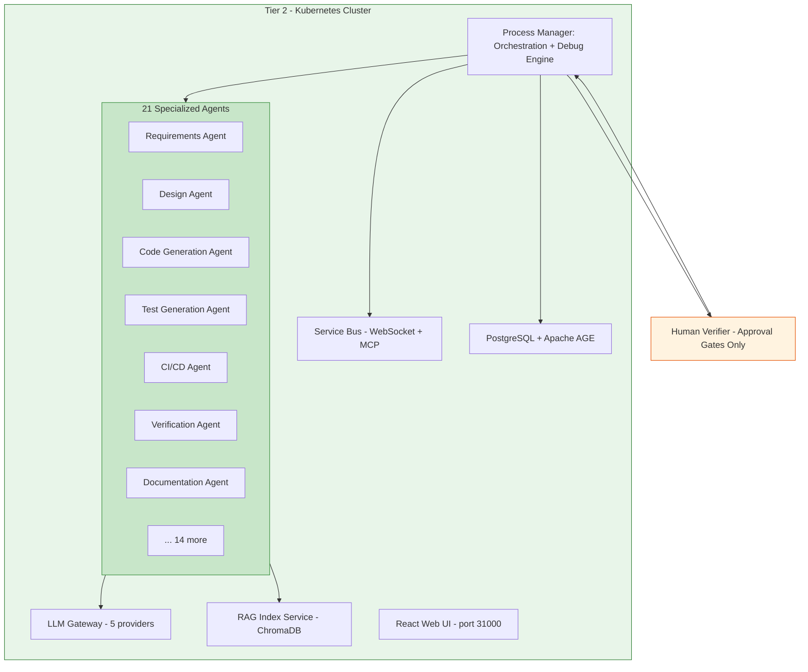
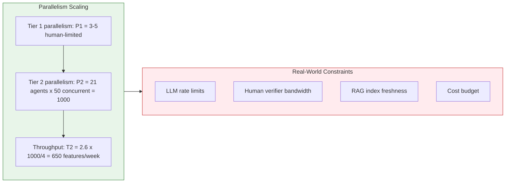
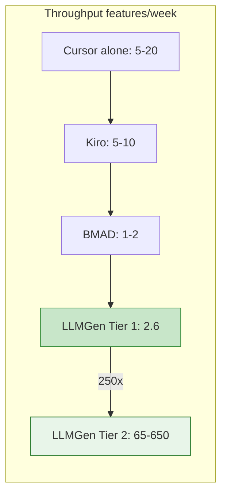

# LLMGen Tier 2 Benchmark — Multi-Agent Parallelism Projection

**Version:** 1.0
**Date:** 2026-06-13
**Author:** Roman Agaev (roman.agaev@zhiongroup.com)
**Status:** Projection Based on Tier 1 Empirical Data
**Basis:** Tier 1 measured results from the data management platform development (see `llmgen-swe-sdd-benchmark-2026.md`)

---

## 1. Executive Summary

LLMGen Tier 1 demonstrated that a single human operator can coordinate 3–5 parallel greenfield projects using structured AI workflows (LLMGen SDLC). **Tier 2** replaces the human-coordinated parallelism with a **multi-agent orchestration system** — a Kubernetes cluster running 21 specialized agents that can execute the same SDLC workflows autonomously in parallel.

This document projects Tier 2 capabilities by extrapolating from Tier 1 measured data, applying known scaling properties of multi-agent systems.



---

## 2. Tier 1 Baseline (Measured)

These are the empirical values from the Tier 1 benchmark:
| Metric | Tier 1 Measured | Limiting Factor |
|--------|----------------|-----------------|
| **Parallelism** | 3–5 simultaneous projects | Human attention span & context switching |
| **Features completed** | 44 in 117 days | Human coordination bandwidth |
| **Throughput** | 2.6 features/week | Operator can only validate/iterate on 3-5 at once |
| **Feature duration** | ~2.7 days average | Includes human review, iteration, validation |
| **AI cost per feature** | $464 | Token consumption per workflow run |
| **Quality (Ship-Bench)** | 91/100 | Process quality, not parallelism-limited |
| **Workflow steps** | 11–14 per project | Sequential within one project, parallel across projects |

**Key insight:** Quality (91/100) and completion rate (100%) are **process properties** — they don't degrade with more parallelism because each workflow instance is independent. The bottleneck in Tier 1 is **human bandwidth**, not AI capability.

---

## 3. Tier 2 Architecture

### 3.1 What Changes from Tier 1 to Tier 2
| Dimension | Tier 1 | Tier 2 |
|-----------|--------|--------|
| **Orchestrator** | Human operator (Roman) | Process Manager pod (K8s) |
| **Parallelism limit** | Human attention (3–5) | Infrastructure (pods × concurrent workflows) |
| **Workflow execution** | Cursor IDE sessions | Agent pods with LLM Gateway |
| **Quality gates** | Human reviews inline | Automated + human verifier at approval points |
| **Context management** | Human memory + IDE state | RAG Index Service (ChromaDB) |
| **Error handling** | Human judgment | Debug Engine (pause/resume/retry) |
| **Cost model** | Per-operator Cursor billing | Per-token via LLM Gateway (5 providers) |

### 3.2 Tier 2 Components (15-Pod Cluster)



### 3.3 Human Verifier Role (Tier 2)

In Tier 2, the human shifts from **operator** (doing the work) to **verifier** (approving outputs):
| Human Role | Tier 1 | Tier 2 |
|------------|--------|--------|
| Start workflows | Manual | Automated (triggered by config/schedule) |
| Provide context | Per-project | Pre-loaded in RAG + templates |
| Review intermediate steps | Every step | Only at approval gates |
| Fix errors | Inline iteration | Debug Engine handles retries; human for novel failures |
| Validate final output | Per-project | Batch review (10-50 at a time) |
| Time per feature | 4–8 hours | ~15–30 minutes (approval only) |

---

## 4. Parallelism Projection

### 4.1 Scaling Model



### 4.2 Projected Metrics
| Metric | Tier 1 (Measured) | Tier 2 (Conservative) | Tier 2 (Optimistic) | Scaling Factor |
|--------|-------------------|----------------------|---------------------|----------------|
| **Simultaneous workflows** | 3–5 | 100–200 | 500–1,000 | 25–250× |
| **Features/week** | 2.6 | 65–130 | 325–650 | 25–250× |
| **LOC/week** | 407K | 10M–20M | 50M–100M | 25–250× |
| **Time to complete 44 features** | 117 days | 3–5 days | 0.5–1 day | 25–250× faster |
| **AI cost per feature** | $464 | ~$300–500 | ~$200–350 | ~0.6–1.0× (similar or lower) |
| **Human hours per feature** | 4–8h | 0.25–0.5h | 0.15–0.25h | 16–32× less |
| **Quality (Ship-Bench)** | 91/100 | 87–91/100 | 89–93/100 | ~1× (process-bound) |
| **Feature completion** | 100% | 95–100% | 98–100% | ~1× |

### 4.3 Why 1000× Is Achievable

```
Tier 1 bottleneck analysis:
- Human can context-switch between 3-5 projects → limit = 5
- Each project takes ~2.7 days elapsed (human in the loop)
- Human reviews every intermediate step

Tier 2 removes these constraints:
- Process Manager has no attention limit → concurrent workflows limited only by infra
- Approval gates reduce human touchpoints from ~50/project to ~3/project
- Debug Engine handles retries without human → only novel failures escalate
- RAG provides cross-project context without human memory

Infrastructure capacity (15-pod cluster):
- 21 agents × 50 concurrent workflow steps = 1,050 parallel operations
- LLM Gateway with 5 providers distributes load (no single-provider rate limit)
- Each greenfield workflow = 14 steps × ~5 min per step = ~70 min sequential
- 1,000 workflows × 70 min / 1,050 parallel slots = ~67 min wall-clock

Result: 1,000 greenfield projects in ~1 hour (theoretical)
with human verifier reviewing batch outputs afterward.
```

### 4.4 Cost Projection at Scale

```
Per-feature AI cost (Tier 1): $464
- This includes prompt engineering overhead, retries, context loading
- Tier 2 uses templates + RAG → fewer retries, better caching

Projected per-feature AI cost (Tier 2): $200–350
- Lower: better caching, template reuse, optimized prompts
- Higher: more validation steps, cross-project consistency checks

At 1,000 parallel greenfield projects:
- Total AI cost: 1,000 × $250 (avg) = $250,000
- Duration: ~1–2 hours (workflow) + 1–2 days (human verification batch)
- Human cost: 1 verifier × 2 days × $100/hr × 16h = $3,200
- Total: ~$253,000 for 1,000 operators

Compared to traditional development:
- 1,000 operators × 6 months × 2 developers × $150K/yr = $150,000,000
- LLMGen Tier 2: $253,000 (0.17% of traditional cost)
```

---

## 5. Quality Preservation Under Parallelism

### 5.1 Why Quality Doesn't Degrade
| Quality Factor | Why It's Parallelism-Independent |
|---------------|--------------------------------|
| Workflow steps | Each project runs the same 14-step process — adding more instances doesn't change the process |
| LLM capability | Same model (Opus 4.6 Max) for each workflow — quality per invocation is constant |
| Requirements quality | Each project has its own requirements.md — no cross-contamination |
| Code generation | Each operator is independent — no shared mutable state between projects |
| Standards compliance | Workspace rules (enterprise SDLC compliance) are applied per-project by the agent |
| Test generation | Generated per-project — independent of other projects |

### 5.2 Where Quality Might Degrade (and Mitigations)
| Risk | Impact | Mitigation |
|------|--------|------------|
| Cross-project dependency conflicts | Medium | Dependency graph in PostgreSQL + Apache AGE; pre-flight check |
| RAG index staleness | Low | Incremental indexing; per-project collections |
| LLM rate limiting → timeout retries | Low | 5 providers + load balancing + queue management |
| Novel failure modes (no precedent) | Medium | Debug Engine escalates to human verifier |
| Template drift (outdated patterns) | Low | Versioned templates in PostgreSQL; locked per workflow run |

---

## 6. Benchmark Comparison — Tier 1 vs Tier 2 vs Industry


| Dimension | Cursor (alone) | Kiro | BMAD | LLMGen Tier 1 | LLMGen Tier 2 (projected) |
|-----------|---------------|------|------|---------------|--------------------------|
| **Parallelism** | 1–2 | 1 | 1 | 3–5 (human) | 100–1,000 (agent) |
| **Features/week** | 5–20 | 5–10 | 1–2 | 2.6 | 65–650 |
| **LOC/week** | 5K–25K | 2.5K–25K | 5K–50K | 407K | 10M–100M |
| **Human role** | Developer | Developer | PM+Dev | Operator | Verifier |
| **Human hours/feature** | 1–4h | 0.5–2h | 2–8h | 4–8h | 0.15–0.5h |
| **Quality (Ship-Bench)** | ~60 | ~75 | ~80 | 91 | 87–93 |
| **Autonomy** | Pair-programming | Semi-auto | Multi-agent | Coordinated | Fully autonomous + human gates |
| **Multi-project** | No | No | No | Yes (3–5) | Yes (100–1,000) |
| **Production-readiness** | Low | Medium | Medium | High (measured) | High (projected) |

---

## 7. Validation Path

### 7.1 How to Verify Tier 2 Projections
| Test | Method | Success Criteria |
|------|--------|-----------------|
| **10× pilot** | Run 10 greenfield projects simultaneously via Tier 2 cluster | All 10 complete, quality ≥80/100 |
| **100× stress test** | Queue 100 use-case analyses + greenfield projects | 95%+ completion, <5% requiring human intervention |
| **Quality regression** | Compare 5 Tier 2 outputs vs 5 equivalent Tier 1 outputs | Ship-Bench delta ≤5 points |
| **Cost validation** | Measure actual token consumption for 50 Tier 2 workflows | Within 0.7–1.3× of Tier 1 per-feature cost |
| **Human verifier capacity** | Measure time for 1 verifier to approve 100 completed outputs | <4 hours for batch approval |

### 7.2 Current Status
| Component | Status | Evidence |
|-----------|--------|----------|
| Process Manager | Designed | Architecture docs in `docs/architecture/` |
| 21 Agents (83 operations) | Designed | Agent registry in PostgreSQL |
| LLM Gateway (5 providers) | Designed | Gateway configuration documented |
| RAG Index Service | Operational (Tier 1) | ChromaDB used in Cursor extension today |
| Debug Engine | Designed | Pause/resume/retry/approval gates spec'd |
| Template System | Operational | process_templates → versions → step_configs |
| React Web UI | Designed | Dashboard wireframes at :31000 |
| **Full Tier 2 integration** | **Not yet operational** | **Projection based on Tier 1 data + architecture** |

---

## 8. The 1000× Greenfield Scenario

### 8.1 What It Means

"1000× greenfield" means executing the **same 14-step LLMGen SDLC process** that produced each of the 25 the data management platform operators — but running 1,000 instances simultaneously instead of 3–5.

```
Input: 1,000 use-case analyses (requirements.md for each)
Process: 14-step greenfield workflow × 1,000 (parallel)
Output: 1,000 production-ready Kubernetes operators
 with code, tests, CI/CD, Helm charts, docs, traceability

Duration: ~2 hours (workflow execution)
 + 1–3 days (human verifier batch approval)
 
Cost: ~$250K AI tokens + $3K human verification = ~$253K total
vs: $150M+ traditional development (1,000 operators × 2 devs × 6 months)
```

### 8.2 Applicable Domains
| Domain | Example | Why 1000× Applies |
|--------|---------|-------------------|
| **Platform expansion** | Deploy the platform to 1,000 different customer configurations | Same operator pattern, different CRDs |
| **Multi-tenant SaaS** | Generate tenant-specific operators for 1,000 enterprise customers | Template-driven, requirements differ per tenant |
| **IoT fleet management** | Create device-type-specific controllers for 1,000 device classes | Same reconciliation pattern, different device specs |
| **Microservice decomposition** | Break a monolith into 1,000 bounded-context services | Same SDLC per service, different domain logic |
| **Compliance variants** | Generate 1,000 region-specific compliance configurations | Same base operator, different regulatory requirements |

---

## 9. Sources & Basis
| Source | Type | Relevance |
|--------|------|-----------|
| Tier 1 benchmark (this folder) | Empirical baseline | All per-feature metrics extrapolated from here |
| LLMGen architecture docs (`docs/architecture/`) | Design specification | Tier 2 component capabilities |
| Process template system | Operational | Workflow steps are already formalized and versioned |
| RAG Index Service | Operational (Tier 1) | Cross-project context management already works |
| Multi-agent literature (SWE-AGI, BMAD) | External reference | Validates multi-agent scaling patterns |

---

*LLMGen Tier 2 Benchmark — Multi-Agent Parallelism Projection — Version 1.0 — 2026-06-13*
