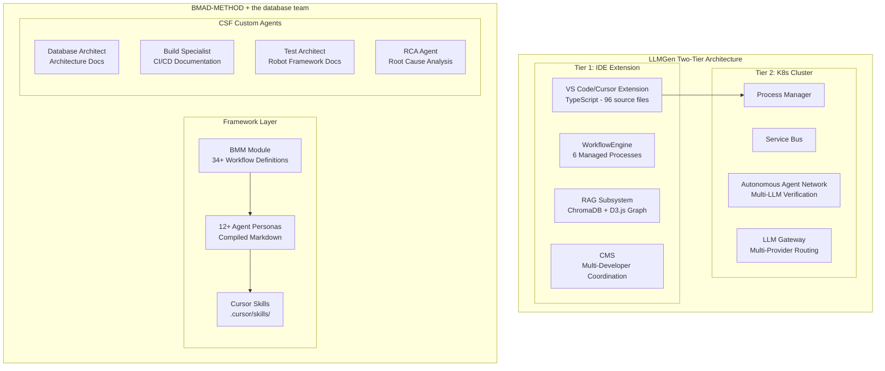
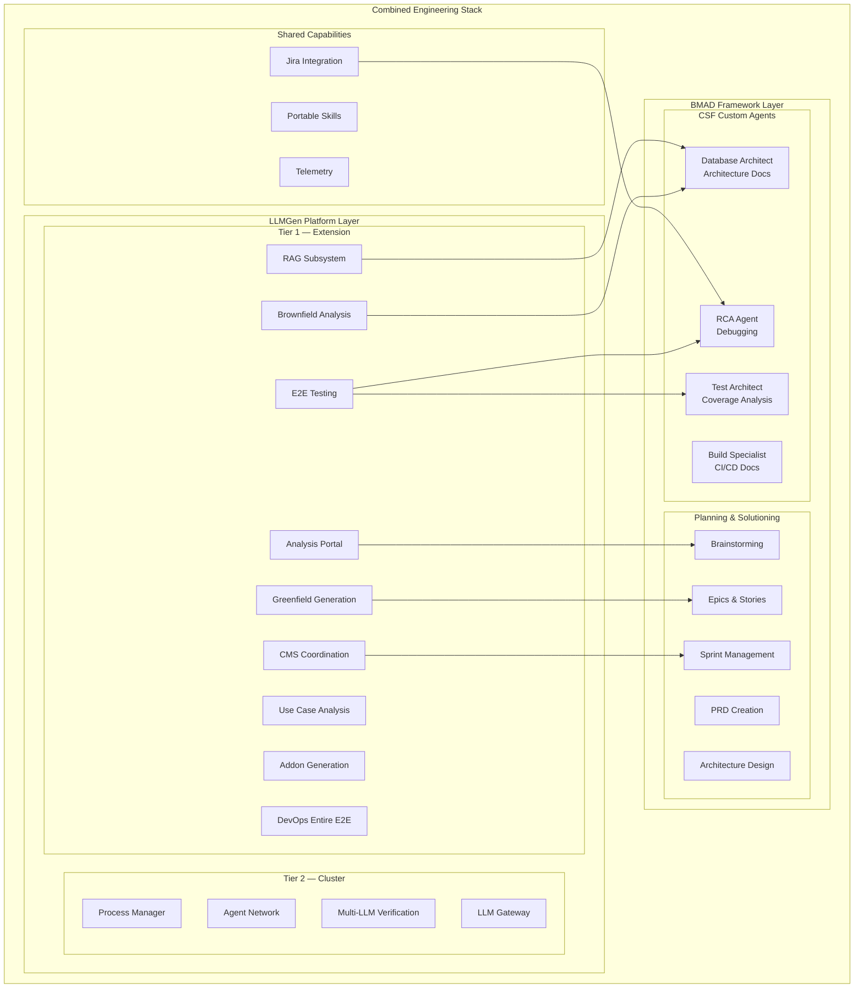

# LLMGen vs BMAD-METHOD (the database team Implementation): Comprehensive Comparison

**Date:** 2026-05-29 
**Version:** 1.7.17 
**Purpose:** Analysis of LLMGen two-tier architecture against the BMAD-METHOD framework as adopted by the database team teams 
**Sources:**
- BMAD-METHOD: https://github.com/bmad-code-org/BMAD-METHOD (v6.2.2, 46K+ stars)
- the database team Confluence: https://[internal wiki]
- the database team Repository: https://[internal repository]
- BMAD Docs: https://docs.bmad-method.org 
**Status:** Draft

---

## Executive Summary

This document provides a comprehensive two-tier comparison between **LLMGen** (AI-driven engineering platform with a two-tier architecture: VS Code/Cursor IDE Extension + Kubernetes multi-agentic cluster with 24 agents, featuring 4-tier verification gates: build+mocks → static analysis → real E2E via Kind → system DevOps E2E) and the **BMAD-METHOD** prompt persona framework as implemented by the the database team team at the organization (role-tagged markdown files activated via Cursor slash commands and skills within a single LLM session).

**Key Finding:** LLMGen and BMAD/CSF operate at fundamentally different architectural levels. BMAD is a **prompt persona framework** — it uses role-tagged markdown files to instruct the LLM to behave as a specific agent within a single chat session. It is not a multi-agentic system in the distributed systems sense: there is no agent runtime, no inter-agent communication, and no context isolation between steps. The entire process runs in one continuous conversation whose context window grows until the session ends. LLMGen is an **engineering platform** with isolated, separately-invoked steps — each step receives a defined input, produces a defined output, and runs in fresh context. The platform provides infrastructure (extension services, RAG, CMS, cluster orchestration) for programmatic workflow execution.

The two approaches are **complementary at the agent management layer but divergent at the execution layer**: BMAD excels at organizing team-engineered persona prompts into a reusable catalog; LLMGen excels at executing engineering pipelines with step-level context isolation, token efficiency, and autonomous verification.



---

## Platform Overview

### LLMGen
| Attribute | Details |
|-----------|---------|
| **Type** | Two-tier AI engineering platform (IDE extension + Kubernetes cluster) |
| **Architecture** | Tier 1: TypeScript extension (96 source files, 38 architectural decisions), Tier 2: Multi-agentic K8s cluster (15+ deployments, 4 nodes) |
| **Primary domain** | Platform engineering, Kubernetes operators, data engineering, full SDLC |
| **Target users** | Architects, DevOps engineers, R&D developers, POs, PLMs, ML engineers, Head of R&D |
| **Core problem** | Full software lifecycle: requirements → architecture → code → tests → deployment → verification |
| **Scale** | System-level: 22 K8s operators, 48+ components, multi-project orchestration |
| **IDE support** | Cursor (primary, v1.7.17), VS Code + Copilot (secondary, v1.0.0) |
| **State management** | CMS with Git-branch-based process tracking (pause, resume, cancel, hand off) |
| **AI execution** | Programmatic: extension services call LLMs via APIs; cluster agents run autonomously |

### BMAD-METHOD (Open Source)
| Attribute | Details |
|-----------|---------|
| **Type** | Prompt persona framework — role-tagged markdown files that instruct the LLM to behave as a specific agent within a single chat session |
| **Architecture** | Single-tier, single-session: persona markdown loaded into LLM context; no separate agent runtime, no inter-agent communication protocol |
| **Primary domain** | General software development — from brainstorming to deployment |
| **Target users** | Individual developers and small teams using AI coding assistants |
| **Core problem** | Structured AI collaboration: analysis → planning → solutioning → implementation |
| **Scale** | Single-project, single-developer focus with scale-adaptive complexity |
| **IDE support** | Claude Code (recommended), Cursor, Codex CLI, any AI IDE with system prompts |
| **State management** | Document-based: output files in `_bmad-output/` carry context between sessions; within a session, context accumulates in the LLM's conversation window with no isolation |
| **AI execution** | Conversational: developer loads a persona prompt, LLM follows instructions in the same continuous session — no step isolation, no fresh context per phase |
| **GitHub stars** | 46,465 |
| **License** | MIT |

### the database team Implementation of BMAD
| Attribute | Details |
|-----------|---------|
| **Type** | Custom BMAD agents for CSF database and infrastructure domain |
| **Custom agents** | 3 BMAD agents (Database Architect, Build Specialist, Test Architect) + 1 non-BMAD RCA Agent |
| **Primary domain** | MariaDB, Kubernetes StatefulSets, Helm charts, Robot Framework testing |
| **Deployment** | Gerrit-hosted repository (the database team), Confluence documentation |
| **Workflow** | 4-phase skill-driven process: Baseline → Agent Guide → Design → Implement |
| **Installation** | `setup-agents.sh` script, manual copy, or Cursor skills |
| **Skills library** | Common skills (upstream checks, Gerrit, Jenkins, Jira) + asset-specific (vendor updates) |

---

## Architecture Comparison

### Execution Model
| Dimension | LLMGen | BMAD/CSF |
|-----------|--------|----------|
| **Runtime architecture** | Two-tier: compiled TypeScript extension + K8s microservices cluster | Single-tier, single-session: persona markdown loaded into one LLM conversation — no separate agent runtime or orchestration layer |
| **Agent definition** | Extension services (WorkflowEngine, PromptManager) + cluster agents (autonomous bounded loops) | Role-tagged markdown files (persona + menu + rules) — the LLM reads the file and assumes the role within the current chat |
| **Agent activation** | Programmatic: extension commands trigger workflow steps, cluster API dispatches agents | Conversational: slash command loads persona markdown into chat context; the LLM session IS the agent |
| **Step isolation** | Each prompt step runs in fresh context with defined inputs/outputs; context does not bleed between steps | No step isolation — the conversation accumulates in one context window throughout the entire process; prone to context distraction and token growth |
| **Multi-agent coordination** | Tier 2: Service Bus + Process Manager orchestrate agent network with 3-verifier consensus (85% threshold) | Party Mode: originally one LLM roleplaying multiple characters; refactored in v6.3 (March 2026) to use IDE subagents, but reverted to single-LLM default due to hallucination issues (Issue #2280) |
| **State persistence** | CMS: Git branches, status files (`codebase_status.yaml`, `_active_work.yaml`), structured process lifecycle | File-based: `_bmad-output/` artifacts carry context between sessions; within a session, all state is in the conversation window |
| **LLM interaction** | Extension: parameterized prompt generation → Ctrl+K or API call; Cluster: autonomous multi-turn with policy bounds | Direct chat: developer types commands, LLM follows persona instructions in a single continuous conversation until the session ends |

### Process Coverage
| LLMGen Process | BMAD Equivalent | the database team Equivalent | Notes |
|----------------|-----------------|----------------------|-------|
| **Greenfield** — build new projects from requirements (6 steps) | `bmad-create-architecture` + `bmad-dev-story` cycle | *None* — CSF agents document existing systems, not generate new ones | LLMGen generates complete K8s operators; BMAD guides story implementation |
| **Brownfield** — analyze existing codebases (9 steps) | *Partial* — Architecture workflows analyze existing code | **[AD]** Database Architect: prepare architecture doc from repo evidence | LLMGen produces 9 structured artifacts; CSF produces single architecture markdown |
| **Use Case Analysis** — high-level design from business requirements (5 steps) | Phase 1-2: `bmad-brainstorming` → `bmad-product-brief` → `bmad-create-prd` | *None* | LLMGen has managed process with path transitions; BMAD separates into independent workflows |
| **Addon** — extend codebases with new features (4 steps) | `bmad-create-story` → `bmad-dev-story` cycle | *None* — CSF agents are documentation-focused | LLMGen manages scope isolation and CMS branch coordination |
| **E2E Testing** — test against real services (5 steps) | *None* — BMAD doesn't execute code or tests | *None* | Unique to LLMGen: deploys and tests against live infrastructure |
| **DevOps Entire E2E** — multi-project deployment and testing | *None* — BMAD operates at single-project level | *None* | Unique to LLMGen: orchestrates across 22+ projects simultaneously |
| *None* | Phase 1: `bmad-brainstorming`, `bmad-prfaq`, research workflows | *None* | BMAD has structured ideation and research workflows |
| *None* | `bmad-code-review` — implementation validation | **RCA Agent** — automated Jira debugging + code review + SCA verification | CSF RCA agent is more comprehensive than BMAD's code review |
| *None* | `bmad-sprint-planning` + `bmad-retrospective` | *None* | BMAD has agile ceremony workflows |
| *None* | *None* | **[ED]** Database Architect: revise existing architecture doc | CSF-specific: update docs after feature merges |
| *None* | *None* | **[AG]** Database Architect: condensed agent-facing architecture guide | CSF-specific: compact doc optimized for model context |
| *None* | *None* | Build Specialist (Forge): CI/CD and build system documentation | CSF-specific: analyze Dockerfiles, Makefiles, Jenkins pipelines |
| *None* | *None* | Test Architect (Robo): Robot Framework and Helm test documentation | CSF-specific: test coverage matrix and gap analysis |

### Agent Ecosystem
| Dimension | LLMGen | BMAD (Core) | the database team (BMAD-derived) |
|-----------|--------|-------------|------------------------|
| **Agent count** | Extension: ~20 services; Cluster: ~10 specialized agents | 12+ personas: PM, Architect, Developer, UX, Analyst, etc. | 4 custom agents: Database Architect, Forge, Robo, RCA |
| **Agent format** | TypeScript classes with programmatic APIs | Role-tagged markdown files (persona + rules + menu) loaded into the LLM's context — the "agent" is the LLM session itself, not a separate process | Same BMAD format + Cursor Skills + custom workflows |
| **Agent intelligence** | Multi-LLM verification (3 verifiers, 85% threshold), policy-bounded autonomous execution | Single-LLM persona in a single continuous session — model follows instructions in loaded markdown with no context boundaries between phases | Single-LLM per agent; RCA uses multi-agent sub-delegation |
| **Agent specialization** | Requirements, design, codegen, test, CI/CD, validation, git, prompt, verification | Generic agile roles adaptable to any domain | Domain-specific: MariaDB, K8s StatefulSets, Helm, Robot Framework |
| **Autonomy level** | Tier 2: bounded autonomous loops with optional `WAITING_APPROVAL`; Tier 1: human-in-loop | Human-driven: developer explicitly chooses workflow and guides conversation | Same as BMAD core; RCA agent has autonomous Jira debugging mode |

---

## Tool Ecosystem
| Tool Category | LLMGen | BMAD/CSF |
|---------------|--------|----------|
| **Enterprise communication** | Outlook CLI (COM + Graph), Teams CLI (webhook + Graph) | *None* |
| **Project management** | Jira CLI (JQL, issues, transitions) | Jira Cursor Skill (CSF custom) |
| **Documentation** | Confluence CLI (pages, CQL, macros) | *None* |
| **Office automation** | Excel CLI, Word CLI, PowerPoint CLI | *None* |
| **Code review** | *None* | Gerrit Cursor Skill (CSF custom), RCA code review sub-agent |
| **CI/CD integration** | *None* (cluster handles deployment) | Jenkins Cursor Skill (CSF custom) |
| **RAG/semantic search** | Multi-collection ChromaDB with AST/YAML chunking, D3.js graph visualization | *None* — relies on IDE's built-in file access |
| **Deployment** | Kind cluster scripts, Docker, K8s manifests, backup/restore | *None* — BMAD doesn't execute code |
| **Telemetry** | Local JSONL with PII redaction, circuit breaker, configurable retention | *None* |
| **Version control** | CMS Git service: branch management, multi-repo sync, conflict detection | Gerrit Cursor Skill (CSF custom) |
| **Installation** | Extension VSIX + cluster manifests | `npx bmad-method install` + `setup-agents.sh` (CSF) |

---

## Skills & Rules Comparison
| Dimension | LLMGen | BMAD (Core) | the database team |
|-----------|--------|-------------|----------|
| **Rule format** | `.cursor/rules/*.mdc` (Cursor-specific MDC format) | Markdown files under `_bmad/` directory tree | Both: `.cursor/skills/` + `_bmad/bmm/` |
| **IDE portability** | Cursor only (primary), VS Code + Copilot (secondary) | Claude Code (recommended), Cursor, Codex CLI, any AI IDE | Cursor primary; BMAD agents are IDE-portable |
| **Workflow definition** | TypeScript WorkflowEngine with step-by-step progress tracking | Markdown workflow files with implicit step sequencing | Markdown skill files with `references/` playbooks |
| **Content scope** | enterprise SDLC compliance/ compliance, coding standards (Python, TS, Java, Go), prompting principles | Generic agile workflows: brainstorming, PRD, architecture, stories, sprints | Domain: MariaDB architecture, Helm testing, vendor updates, golang-ci |
| **Discovery** | Cursor rules auto-load based on file globs + manual commands | `bmad-help` skill inspects project and recommends next workflow | Cursor skill auto-detection + slash commands |
| **Count** | ~10 rule files + 52 prompt command files | 34+ workflow definitions + 12+ agent personas | ~15 custom skills across common, asset-specific, and workflow categories |
| **Customization** | Extend via `.mdc` rules and `.cursor/commands/` | BMad Builder (BMB) module for creating custom agents/workflows | Custom agents via `setup-agents.sh` or manual installation per `README.md` |

---

## Architectural Depth Analysis

### LLMGen Tier 1 (Extension) vs BMAD/CSF IDE Integration

Both LLMGen's extension and BMAD/CSF's Cursor integration operate at the IDE level, but with fundamentally different approaches:
| Aspect | LLMGen Extension | BMAD/CSF in Cursor |
|--------|-----------------|-------------------|
| **Codebase** | 96 TypeScript source files across commands, services, views, models | ~5-10 markdown files per agent (compiled agent + stub + skills + references) |
| **Services** | 20+ services: WorkflowEngine, IndexManager, RAGGraphBuilder, CMS, Telemetry, ResumeService, ImpactAnalysis, PromptManager, etc. | No custom services — relies entirely on the IDE's built-in capabilities |
| **UI components** | 15+ WebViews: progress tracking, RAG graph, analysis portal, design review, traceability, impact analysis | No custom UI — all interaction through the IDE's native chat interface |
| **State management** | Structured process lifecycle with Git-based CMS (pause, resume, cancel, hand off across developers) | File-based: output documents in `_bmad-output/` + `sprint-status.yaml` |
| **RAG capability** | Built-in ChromaDB with 4 specialized collections, AST-based chunking, D3.js visualization | None — relies on IDE's native file access and context window |
| **Observability** | Built-in telemetry service with JSONL logging, circuit breaker, PII redaction, metrics reports | None |
| **Cross-platform** | Shared core services between Cursor and VS Code + Copilot variants | BMAD: multi-IDE (Claude Code, Cursor, Codex); CSF agents: primarily Cursor |

### LLMGen Tier 2 (Cluster) vs BMAD — No Equivalent

As a prompt persona framework where the "agent" is simply the LLM session following a role-tagged markdown file, BMAD has **no equivalent** to LLMGen's Tier 2 autonomous cluster:
| LLMGen Tier 2 Capability | BMAD Equivalent |
|--------------------------|-----------------|
| Process Manager with REST/gRPC API | *None* — no server-side orchestration |
| Service Bus for inter-agent communication | *None* — agents don't communicate with each other programmatically |
| Multi-LLM verification (3 verifiers, 85% threshold) | *None* — single LLM follows persona instructions |
| Multi-provider LLM routing (OpenAI, Anthropic, local) | *None* — uses whichever LLM the IDE provides |
| Autonomous bounded execution loops with policy validation | *None* — human drives all agent interactions |
| Kubernetes-native deployment (Kind, 4 nodes, 15+ services) | *None* — BMAD is a file-based framework |
| Dashboard and monitoring UI | *None* |
| Team-scale multi-developer coordination | *None* — BMAD is designed for single-developer workflows |

This represents the **most significant architectural gap** between the two systems. BMAD is a prompt persona framework — the "agents" are markdown role descriptions loaded into a single LLM session that runs continuously with no context isolation. LLMGen's Tier 2 is an autonomous engineering platform with isolated agent invocations, fresh context per step, multi-LLM verification, and infrastructure-level orchestration. The difference is not just scope — it is a fundamentally different execution model: persona-prompts in a growing conversation vs. programmatic steps with bounded context.

---

## the database team-Specific Analysis

### CSF's Four-Phase Workflow

the database team has built a **custom development workflow** on top of BMAD:
| Phase | CSF Workflow | LLMGen Equivalent | Notes |
|-------|-------------|-------------------|-------|
| **1. Baseline** | Reverse-engineer architecture doc from repo (`db-architect` [AD]) | Brownfield Analysis (steps 1-5) | Both analyze existing code; LLMGen produces more structured artifacts |
| **2. Agent Guide** | Distill architecture into compact agent routing guide (`db-architect` [AG]) | *None* — LLMGen's RAG index serves similar purpose | CSF creates human-readable guide; LLMGen uses machine-queryable vector index |
| **3. Design** | Produce proposal, detailed design, task checklist per Jira story (`solution-design` skill) | Use Case Analysis (5 steps) + Addon design (step 1) | CSF routes through architecture baseline; LLMGen has managed process with path transitions |
| **4. Implement** | Execute tasks one-by-one, keep docs in sync (`solution-implement` skill) | Addon Generation (steps 2-4) | Both produce code; CSF emphasizes documentation sync |

### CSF's RCA Agent — Unique Capability

The the database team RCA Agent (sourced from CMG Multi-Agent Framework) provides capabilities absent from both BMAD core and LLMGen:
| Feature | Details |
|---------|---------|
| **Architecture** | Multi-agent with 4 Jira sub-agents + 4 domain debug experts |
| **RCA-only mode** | Data collection → parallel analysis → root cause → report |
| **Full mode** | RCA + automatic fix + code review verification + static analysis |
| **Trigger** | Natural language: "debug CSFS-12345", "RCA for JIRA-54321" |
| **Platform** | Runs in Cursor, Windsurf, Augment — IDE-agnostic |

### CSF's Cursor Skills Library

CSF maintains a library of Cursor Skills beyond BMAD agents:
| Category | Skills | LLMGen Equivalent |
|----------|--------|-------------------|
| **Common** | Upstream version checks, golang-ci validation, Jira ticket creation, Gerrit review, Jenkins build | Jira CLI (partial), no CI integration |
| **Asset-specific** (CVLK) | Vendor update pipelines for valkey, hiredis, redis++, exporter | *None* — LLMGen generates new code, not vendor updates |
| **Dev Workflow** | 4-phase architecture-first workflow (baseline → guide → design → implement) | Brownfield → Use Case → Addon pipeline |

---

## Gap Analysis

### Gaps in LLMGen (Available in BMAD/CSF)
| # | Gap | BMAD/CSF Source | Impact | Recommendation |
|---|-----|----------------|--------|----------------|
| 1 | **No structured ideation/research phase** | BMAD Phase 1: brainstorming, PRFAQ, market/domain/technical research | Requirements may start from assumptions rather than validated insights | Consider adding analysis phase before Use Case Analysis |
| 2 | **No structured persona catalog** | BMAD organizes role-tagged markdown files with menus, rules, and activation conventions | LLMGen prompts are functional but lack a catalog structure for organizing them as a team asset | Could adopt BMAD-style persona catalog for `.cursor/commands/` |
| 3 | **No IDE-agnostic agent portability** | BMAD agents work in Claude Code, Cursor, Codex, Windsurf, Augment | LLMGen is Cursor/VS Code only | Publish processes as `.agents/skills/` alongside `.cursor/rules/` |
| 4 | **No sprint/agile ceremony workflows** | BMAD: sprint planning, retrospective, correct-course, sprint status | LLMGen tracks process state but lacks formal agile ceremony support | Low priority — LLMGen CMS provides equivalent coordination |
| 5 | **No architecture documentation agent** | CSF Database Architect: evidence-grounded architecture docs with [AD], [ED], [AG] | LLMGen's brownfield produces analysis but not formal architecture documents | Could integrate CSF-style architecture documentation into brownfield output |
| 6 | **No CI/CD documentation agent** | CSF Build Specialist (Forge): CI/CD, Dockerfiles, Makefiles documentation | LLMGen generates CI/CD but doesn't document existing build systems | Could add as brownfield sub-workflow |
| 7 | **No test coverage gap analysis** | CSF Test Architect (Robo): Robot Framework coverage matrix and gap analysis | LLMGen runs E2E tests but doesn't analyze test coverage systematically | Could integrate into E2E Testing workflow |
| 8 | **No `bmad-help` equivalent** | BMAD `bmad-help` inspects project state and recommends next action | Developers must know which LLMGen command to run | Analysis Portal partially fills this; could add intelligent recommendation |
| 9 | **No RCA/debugging capability** | CSF RCA Agent: multi-agent root cause analysis with Jira integration | Cannot debug production issues in generated operators | Create Go/K8s debugging skill based on CSF RCA pattern |

### Gaps in BMAD/CSF (Available in LLMGen)
| # | Gap | LLMGen Source | Impact | Recommendation |
|---|-----|--------------|--------|----------------|
| 1 | **No autonomous execution** | Tier 2: K8s cluster with autonomous agent network, multi-LLM verification | BMAD requires human in every step; cannot scale to team-level automation | Fundamentally different scope — BMAD is intentionally human-driven |
| 2 | **No RAG/semantic search** | Multi-collection ChromaDB with AST-based chunking, D3.js graph visualization | Relies on IDE's context window; may miss relevant context in large codebases | Could benefit from vector indexing for architecture evidence gathering |
| 3 | **No multi-developer coordination** | CMS with Git-branch-based process tracking, conflict detection, team dashboard | BMAD is single-developer; CSF's Gerrit skill is limited to code review submission | Critical gap for team-scale adoption |
| 4 | **No enterprise tool integration** | 7 CLIs: Outlook, Teams, Confluence, Jira, Excel, Word, PowerPoint | Cannot notify teams, update docs, or create tickets automatically | CSF has Jira/Gerrit/Jenkins skills, but missing communication/documentation CLIs |
| 5 | **No deployment automation** | Kind cluster, Docker, K8s manifests, backup/restore, E2E testing | BMAD doesn't execute code or deploy; CSF agents only document | Different scope — BMAD is a planning framework |
| 6 | **No impact analysis/traceability** | Traceability chain (Input→Codebase→Implementation), impact graph with strength detection | No way to trace requirements through to code | Useful for large CSF codebase management |
| 7 | **No process state management or context isolation** | CMS lifecycle: pause, resume, cancel, hand off across developers and sessions; each step runs in fresh context | Workflow state lives in the conversation window and is lost between sessions; within a session, context grows unboundedly with no isolation between phases | `sprint-status.yaml` is minimal; Git-based state and step isolation would be more robust |
| 8 | **No telemetry/observability** | Local JSONL with PII redaction, circuit breaker, metrics reports | No visibility into AI interaction quality or workflow efficiency | Could adopt LLMGen's telemetry pattern |
| 9 | **No full code generation pipeline** | Greenfield: 6-step process producing complete K8s operators with tests | BMAD guides story implementation; CSF agents document but don't generate infrastructure | Fundamentally different scope |
| 10 | **No multi-project orchestration** | DevOps Entire E2E: deploys and tests across 22+ projects simultaneously | Each BMAD project is independent; no cross-project coordination | Would require server-side orchestration (LLMGen Tier 2 pattern) |

---

## Integration Opportunities

### High-Value Integrations
| # | Integration | Effort | Value | Description |
|---|-------------|--------|-------|-------------|
| 1 | **Adopt BMAD-style persona catalog for LLMGen prompts** | Medium | High | Structure LLMGen's 52 prompt files with BMAD-style menus, persona tags, and activation conventions — improves developer discoverability |
| 2 | **Publish LLMGen processes as portable skills** | Medium | High | Create `.agents/skills/SKILL.md` versions alongside `.cursor/rules/` for cross-IDE discovery (Claude Code, Windsurf, Augment) |
| 3 | **Integrate CSF RCA pattern into LLMGen E2E** | Medium | High | Add root cause analysis capability for generated K8s operators — leverages CSF's proven multi-agent RCA approach |
| 4 | **Add architecture documentation output to LLMGen brownfield** | Low | Medium | Generate BMAD-style architecture documents as brownfield artifacts — aligns with CSF's evidence-grounded approach |
| 5 | **Make LLMGen CLIs available as Cursor Skills** | Medium | High | Publish Jira, Confluence, Outlook, Teams CLIs as standalone Cursor Skills usable by the database team agents |
| 6 | **Share RAG capability with CSF agents** | High | High | Expose LLMGen's ChromaDB RAG as a service/skill that CSF architecture agents can query for evidence gathering |
| 7 | **Adopt `bmad-help` pattern for LLMGen** | Low | Medium | Add intelligent project-state inspection and next-step recommendation to Analysis Portal |
| 8 | **CSF test gap analysis in LLMGen E2E** | Low | Medium | Integrate Robo-style coverage matrix into LLMGen's E2E testing workflow for systematic gap detection |

### Architectural Alignment Diagram



---

## Philosophical Differences
| Dimension | LLMGen | BMAD/CSF |
|-----------|--------|----------|
| **Verification Gates** | 4-tier: build+mocks → static analysis → real E2E (Kind) → system DevOps E2E | None — human drives all |
| **Token Efficiency** | Step-segregated: 40-55% reduction, fresh context per step | Single session: context grows unbounded |
| **CI/CD Generation** | Generates Jenkins, ArgoCD, Crossplane, FluxCD as SDLC output | Not addressed |
| **CMS** | Multi-developer coordination, Team Dashboard, auto-sync | Not addressed |
| **Design philosophy** | Platform engineering: build infrastructure that executes isolated workflow steps | Prompt persona catalog: organize role-tagged markdown files that structure human-AI collaboration within a single session |
| **Control model** | Extension manages process flow programmatically; cluster executes autonomously | Human maintains control; persona prompt provides structure within one continuous conversation |
| **Scalability** | Team-level: CMS coordinates multiple developers; cluster handles parallel execution | Individual: one developer, one chat session, one workflow at a time |
| **Quality assurance** | Multi-LLM verification (3 verifiers, consensus threshold), automated E2E testing | Human review at each step; `bmad-code-review` for implementation validation |
| **Context management** | Step isolation: each prompt step runs in fresh context with defined I/O; RAG provides cross-step memory via vector-indexed collections | Single-session accumulation: conversation grows continuously with no context boundaries; output documents bridge between sessions but not within one |
| **Token efficiency** | Bounded: each step consumes only its input context; total cost scales linearly with steps, not with conversation length | Unbounded: context window grows monotonically through the process; later phases pay for all prior conversation tokens |
| **Deployment scope** | End-to-end: generates, tests, deploys, verifies entire systems | Documentation: generates planning artifacts and code; never deploys |
| **Adaptability** | Fixed workflows optimized for K8s/data platform domain | Scale-adaptive: adjusts from bug fixes to enterprise systems |
| **Community** | Internal platform | Open source, 46K+ stars, active community, MIT license |

---

## Context Window and Token Efficiency Analysis

BMAD's single-session architecture creates a **documented token consumption problem** that the BMAD community has actively reported and attempted to mitigate. LLMGen's step-isolated architecture avoids this problem by design.

### BMAD Token Consumption — Evidence from BMAD's Own Issue Tracker
| Source | Finding |
|--------|---------|
| [Issue #1235](https://github.com/bmad-code-org/BMAD-METHOD/issues/1235) — "Excessive Token Usage in Workflows" | `create-story` workflow consumes **80K–100K tokens per analysis step** using Claude Sonnet. Architecture doc (4800 lines) + PRD (1400 lines) analyzed unboundedly. Declared "impractical for normal usage." |
| [Issue #1343](https://github.com/bmad-code-org/BMAD-METHOD/issues/1343) — "Reduce BMAD Agent Context Window Usage" | TEA agent alone consumes **86% of Claude's 200K context** (571 KB / 143K tokens) during activation, leaving only ~30% for actual work. Agents consume **67%+ of context on activation**. Users are forced to start new sessions mid-task and lose conversation history. |
| [Issue #1471](https://github.com/bmad-code-org/BMAD-METHOD/issues/1471) — "Prevent Context Saturation" | Brownfield projects experience context overflow when story decomposition generates massive task lists combined with legacy code context. |
| [Issue #511](https://github.com/bmad-code-org/BMAD-METHOD/issues/511) — "big tokens cost" | Early complaint about unsustainable API token costs from BMAD workflows. |
| [Issue #2343](https://github.com/bmad-code-org/BMAD-METHOD/issues/2343) — "Codex warns BMAD exceeds startup budget" (April 2026) | Codex IDE warns that BMAD skill descriptions exceed the startup context budget when many skills are installed. |

### Why Single-Session Architecture Causes This

BMAD's execution model loads persona prompts, knowledge bases, and project context into **one continuous conversation**. As the process progresses through phases (brainstorming → PRD → architecture → stories → implementation), every prior message remains in the context window:

```
BMAD context growth (single session):
 Activation: persona + knowledge + project-context = ~67-86% of 200K
 Phase 1 output: + brainstorming conversation = context grows
 Phase 2 output: + PRD analysis conversation = context grows further
 Phase 3 output: + architecture analysis conversation = context grows further
 ...
 Phase N: conversation history fills remaining capacity → context overflow
```

This leads to three compounding problems:

1. **Context exhaustion**: The conversation reaches the model's context limit mid-process, forcing the user to start a new session and manually re-establish context — losing all prior conversation history.
2. **Quality degradation**: Research shows LLMs exhibit 13.9%–85% performance drops as input length increases, even with perfect retrieval (Context Rot). The "Lost in the Middle" effect causes models to miss information in the middle of long contexts, losing 20+ percentage points of accuracy.
3. **Cost escalation**: Every subsequent message pays for all prior conversation tokens. A multi-phase BMAD session can consume 500K–1M+ tokens total, while the same work in isolated steps would consume a fraction.

### LLMGen Step-Isolated Model — How It Avoids This

LLMGen's architecture uses **separately-invoked prompt steps**, each with defined inputs and outputs:

```
LLMGen context per step (isolated):
 Step 1 (Analysis): prompt + input artifacts = bounded context → output artifact
 Step 2 (Design): prompt + Step 1 output only = bounded context → output artifact
 Step 3 (Generation): prompt + Step 2 output only = bounded context → output artifact
 ...
 Step N: prompt + Step N-1 output only = bounded context → output artifact
```

Each step starts with a fresh context containing only its prompt and defined inputs. The total token cost scales **linearly with the number of steps**, not with the cumulative conversation length.

### Quantitative Comparison
| Metric | BMAD (Single Session) | LLMGen (Step Isolated) |
|--------|----------------------|----------------------|
| **Context at activation** | 67–86% consumed by persona + knowledge | ~5–10% consumed by step prompt |
| **Context growth pattern** | Monotonically increasing — every message adds to the window | Reset per step — each step starts fresh |
| **Theoretical limit** | Hits model context limit (200K–1M tokens) during complex processes | Never hits limit — each step is independently bounded |
| **Quality over time** | Degrades as context grows (Lost in the Middle, Context Rot) | Consistent — each step sees only relevant, bounded context |
| **Cost per phase** | Later phases pay for all prior conversation tokens | Each phase pays only for its own input |
| **Session continuity** | Must restart sessions when context overflows, losing conversation history | No restart needed — steps are designed to be independent |
| **Multi-phase total cost** | Quadratic growth: O(n²) where n = conversation turns | Linear growth: O(n) where n = number of steps |

### BMAD's Mitigation Attempts

The BMAD team has acknowledged this architectural limitation and attempted mitigations (Issues #1235, #1343):

- **Lazy-loading knowledge bases** — load on-demand instead of at activation (targeting 25–70% savings)
- **Sub-agents** — delegate work to child processes with separate context (v6.1+, but buggy per Issue #2280)
- **Slim knowledge files** — compressed versions of reference documents
- **Progressive workflow disclosure** — keep workflows split to limit per-step scope

These mitigations reduce the severity but do not eliminate the fundamental problem: within a session, context still accumulates monotonically. LLMGen's step isolation eliminates this problem architecturally.

---

## Conclusion

LLMGen and BMAD/CSF represent two distinct layers of AI-assisted engineering:
| Dimension | LLMGen | BMAD (Core) | the database team (BMAD-derived) |
|-----------|--------|-------------|------------------------|
| **Layer** | Engineering platform — isolated steps with fresh context, builds and deploys systems | Prompt persona framework — role-tagged markdown files in a single continuous LLM session | Documentation system — documents existing infrastructure |
| **Scope** | Full SDLC across multiple projects | Single project, requirements to code | Single repository, architecture to test documentation |
| **Output** | Deployed, tested K8s operators and services | PRD, architecture docs, implemented stories | Architecture docs, CI/CD docs, test coverage, RCA reports |
| **Unique strength** | Step-isolated execution + multi-LLM verification + CMS coordination + token efficiency | Structured agile persona catalog + IDE portability + scale-adaptive intelligence | Domain expertise: MariaDB, K8s, Helm, Robot Framework |
| **Maturity** | Production: 22 operators, 2200+ test functions, 267K lines of code generated | Production: 46K GitHub stars, active community, v6.x | Deployed: 4 custom agents, skills library, 4-phase workflow |

The highest-value immediate actions are:
1. **Publish LLMGen processes as portable `.agents/skills/`** — enables cross-IDE adoption and collaboration with the database team teams
2. **Integrate CSF's RCA multi-agent pattern** — adds production debugging capability to LLMGen's E2E workflow
3. **Adopt BMAD-style persona catalog** — improves developer discoverability for LLMGen's 52 prompt files
4. **Share LLMGen's RAG and enterprise CLIs as Cursor Skills** — enables CSF agents to leverage vector search and enterprise tool integration

---

## Changelog
| Version | Date | Change |
|---------|------|--------|
| 1.7.17 | 2026-05-07 | Corrected BMAD classification from "agents framework" to "prompt persona framework" — BMAD agents are role-tagged markdown loaded into a single LLM session, not distributed multi-agent processes. Added context isolation and token efficiency as key architectural differentiators. Party Mode's evolution documented (PR #2160 subagent refactor, Issue #2280 regression to solo mode). Added "Context Window and Token Efficiency Analysis" section with evidence from BMAD's own issue tracker (Issues #1235, #1343, #1471, #511, #2343) demonstrating 67–86% context consumption on activation, 80K–100K tokens per analysis step, and session continuity failures. Quantitative comparison of single-session (quadratic) vs step-isolated (linear) token growth. |
| 1.7.17 | 2026-05-06 | Initial comprehensive comparison |

*Document generated from live Confluence crawl of CSF Development space, BMAD-METHOD GitHub repository analysis (including PR #2160, Issue #2280), and workspace architecture documentation review. Analysis covers LLMGen v1.7.17 against BMAD-METHOD v6.x and the database team custom agents.*
