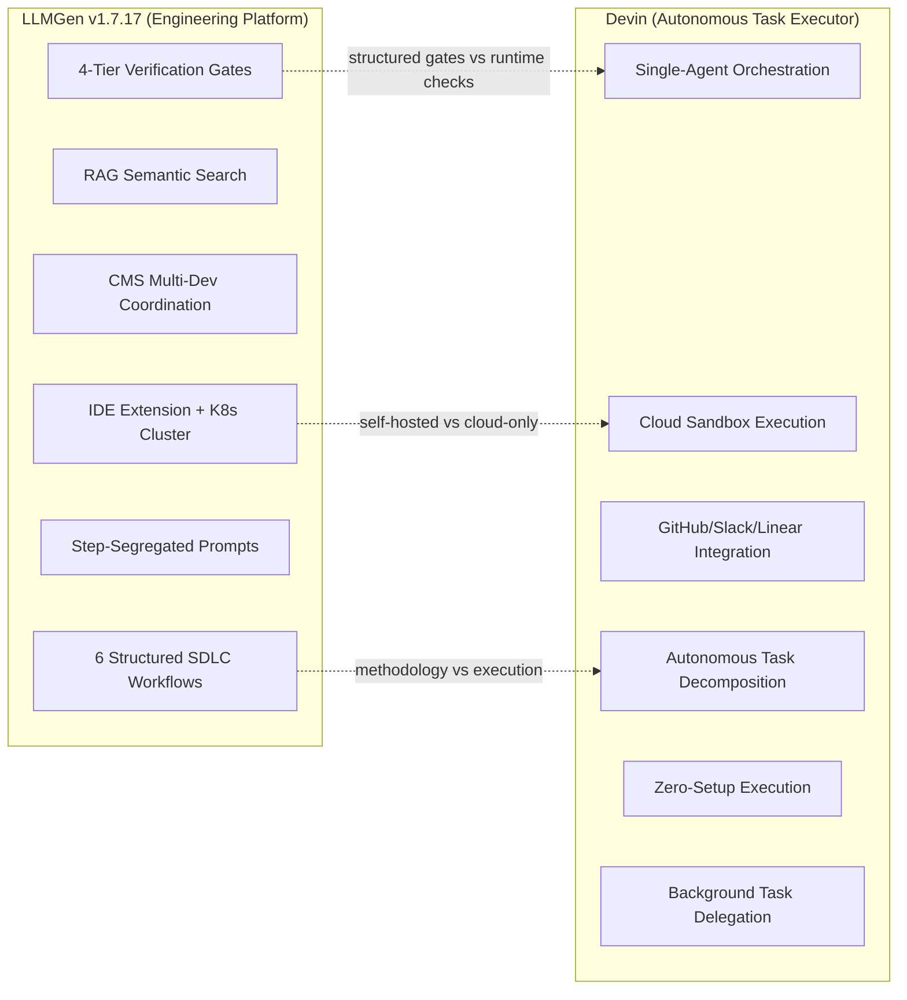
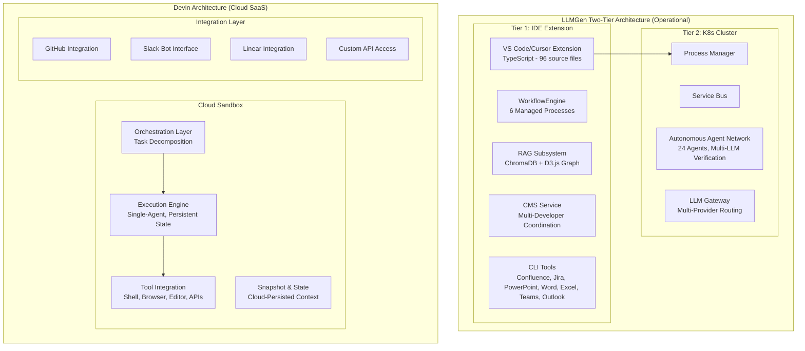
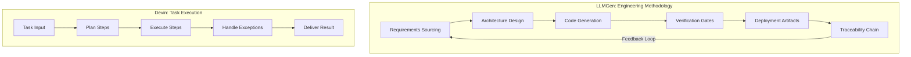
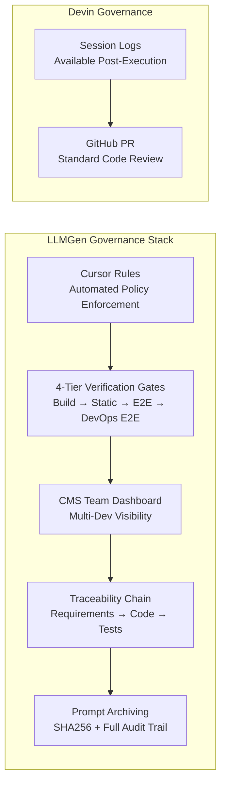

# LLMGen vs Devin (Cognition): Comprehensive Comparison

**Date:** 2026-05-29 
**Version:** 1.7.17 
**Purpose:** Analysis of LLMGen platform capabilities against Devin, Cognition's autonomous AI software engineer 
**Sources:**
- Devin: Public documentation, Nubank case study, Cognition product announcements (2024–2026)
- LLMGen workspace: `vscode_extension/cursor/` + `docs/` 
**Status:** Draft

---

## Executive Summary

This document provides a comprehensive comparison between **LLMGen** (an operational AI-driven engineering platform with IDE extension + Kubernetes multi-agentic cluster, v1.7.17) and **Devin** (Cognition's cloud-hosted autonomous AI software engineer, $6B+ valuation, backed by Founders Fund, Lux Capital, General Catalyst).

**Key Finding:** LLMGen and Devin operate at **fundamentally different levels of the engineering stack**. Devin is an **autonomous task executor** — it takes a single task, breaks it into steps, calls tools, and handles exceptions to produce a result. LLMGen is a **complete SDLC platform** — it replaces the engineering methodology itself with structured workflows, multi-developer coordination, enterprise governance, and tiered verification gates. Devin is a "coding assistant on steroids"; LLMGen is an "engineering platform."

Devin replaces **developer effort on single tasks**. LLMGen replaces **the engineering process** across teams, projects, and the full software lifecycle.

---

## Platform Overview

### LLMGen v1.7.17
| Attribute | Details |
|-----------|---------|
| **Type** | Deployed AI-driven engineering platform — **Two-Tier Architecture**: Tier 1 (VS Code/Cursor extension, interactive) + Tier 2 (Kubernetes multi-agentic cluster, autonomous process multiplication at scale) |
| **Maturity** | Production — v1.7.17, 96+ TypeScript source files, deployed to multiple teams |
| **Primary Domain** | Platform engineering, Kubernetes operators, data engineering, any software project |
| **Target Users** | Architects, DevOps engineers, R&D developers, POs, PLMs, ML engineers, Head of R&D |
| **Core Problem** | Full software lifecycle: requirements → architecture → code → tests → deployment → verification |
| **Agent Architecture** | Multi-agentic: 24 specialized agents in K8s cluster with service bus, LLM gateway, multi-provider routing |
| **Workflows** | 6 managed processes: Brownfield (9 steps), Greenfield (4 steps), Addon, Use Case (5 steps), E2E Testing, DevOps E2E. Tier 2 adds custom process template creation + debug mode before release |
| **Verification** | 4-tier quality gates: Tier 1 (build, lint, readiness with mocks), Tier 1.5 (static analysis), Tier 2 (E2E — real K8s deployment), Tier 3 (DevOps E2E — system-level multi-project) |
| **Deployment** | Self-hosted (on-premises K8s cluster) — data never leaves customer infrastructure |
| **IDE Support** | Cursor (primary), VS Code + Copilot (secondary) |
| **Integrations** | Jira, Confluence, GitLab, Teams, Email, PDF. CI/CD pipelines (Jenkins, GitLab CI, GitHub Actions, ArgoCD, Crossplane, FluxCD) are *generated as part of the SDLC output*, not consumed as integrations |
| **RAG** | ChromaDB with multi-collection indexing, cross-index query, D3.js graph visualization |
| **CMS** | Multi-developer coordination, automated branch management, team view, notifications |
| **Compliance** | enterprise SDLC compliance standards built into every workflow via Cursor Rules |

### Devin (Cognition)
| Attribute | Details |
|-----------|---------|
| **Type** | Cloud-hosted autonomous AI software engineer (SaaS) |
| **Maturity** | Commercial — GA since 2024, $6B+ valuation (2026), multiple enterprise customers (Nubank, etc.) |
| **Primary Domain** | General-purpose software engineering tasks |
| **Target Users** | Individual developers, engineering teams delegating background tasks |
| **Core Problem** | Autonomous task execution: take a task description, execute it end-to-end without human intervention |
| **Agent Architecture** | Single-agent with orchestration layer — one agent per task, cloud sandbox with persistent state |
| **Workflows** | Unstructured — Devin decomposes tasks dynamically, no predefined workflow templates |
| **Verification** | Runtime checks within task execution — no structured verification tiers or gates |
| **Deployment** | Cloud-only (Cognition infrastructure) — no self-hosted option for most customers |
| **IDE Support** | IDE-independent — operates via web UI, Slack, or API; no IDE extension |
| **Integrations** | GitHub, Slack, Linear, custom APIs |
| **RAG** | Not applicable — relies on codebase context within cloud sandbox |
| **CMS** | Not applicable — single-developer, single-task focus |
| **Compliance** | No built-in compliance framework |

---

## Architecture Comparison

---

## Feature Comparison Matrix
| Category | LLMGen v1.7.17 | Devin (Cognition) |
|----------|----------------|-------------------|
| **Operating Model** | ✅ SDLC platform with structured workflows, gates, and governance | ⚠️ Autonomous task executor — takes a task, returns a result |
| **Agent Architecture** | ✅ Multi-agentic: 24 specialized agents with cross-verification in K8s cluster | ⚠️ Single-agent: one agent per task with orchestration layer (no multi-agent verification) |
| **Brownfield Analysis** | ✅ 9-step structured workflow (Clone → Index → Analyze → Document → Requirements → Design → Traceability → Gap Resolution → Transition) | ❌ Not addressed — no structured reverse-engineering methodology |
| **Greenfield Development** | ✅ 4-step workflow with requirement sourcing and structured artifact generation | ⚠️ Can generate code from scratch, but unstructured — no requirement traceability or design artifacts |
| **Addon/Feature Development** | ✅ Dedicated 4-phase workflow with design tracking and diff approval | ⚠️ Can implement features, but no structured phase gates or design tracking |
| **CI/CD Pipeline Generation** | ✅ Generates Jenkins, GitLab CI, GitHub Actions, ArgoCD, Crossplane, Terraform, FluxCD as deployment-ready artifacts | ⚠️ Can create CI configs as part of a task, but no structured pipeline generation methodology |
| **Verification Gates** | ✅ 4-tier gates: build+lint+mocks → static analysis → real E2E deployment → system-level DevOps E2E. 100% pass rate | ❌ No structured verification — relies on runtime checks within task execution |
| **Multi-Developer Coordination** | ✅ CMS with team view, branch management, conflict detection, auto-sync, Teams/Email notifications | ❌ Single-developer, single-task — no multi-developer coordination |
| **RAG/Semantic Search** | ✅ ChromaDB, 4 specialized collections, cross-index query, D3.js graph visualization | ❌ No RAG system — relies on in-context codebase within cloud sandbox |
| **Step-Segregated Prompts** | ✅ 40–55% token reduction, SHA256 archived, full auditability, no context degradation | ❌ Single-session execution — context accumulates within one run |
| **Compliance Framework** | ✅ enterprise SDLC compliance standards built into every workflow via Cursor Rules (automated enforcement) | ❌ No built-in compliance — relies on developer-provided instructions per task |
| **Self-Hosted Deployment** | ✅ On-premises K8s cluster — data never leaves customer infrastructure | ❌ Cloud-only — all code and data processed on Cognition infrastructure |
| **Governance & Auditability** | ✅ Cursor Rules as automated governance, prompt archiving with SHA256, full traceability chain | ⚠️ Session logs available, but execution is opaque — less auditable than step-segregated approach |
| **Task Autonomy** | ⚠️ Human-in-the-loop: structured workflows with approval gates at each step | ✅ Fully autonomous: takes task, executes end-to-end, handles exceptions |
| **Zero-Setup Experience** | ⚠️ Requires IDE extension installation + K8s cluster for Tier 2 | ✅ Zero setup: paste a task, Devin executes in cloud sandbox |
| **Background Execution** | ⚠️ Tier 2 cluster provides autonomous process execution | ✅ Core value proposition: delegate tasks, Devin works in background |
| **Jira Integration** | ✅ Operational — JQL search, multi-select tickets, auto-conversion to requirements | ❌ Not available (GitHub Issues, Linear) |
| **Confluence Integration** | ✅ Operational — CQL search, page selection, markdown conversion | ❌ Not available |
| **Impact Analysis** | ✅ Traceability chain with D3.js graph visualization across codebases | ❌ Not addressed |
| **Multi-Role Support** | ✅ 8 role-specific guides (R&D, DevOps, PO, PLM, ML, Operations, Head R&D, Head Ops) | ❌ Single-role: developer (individual contributor) |
| **Source Analysis Reports** | ✅ 10-section automated reports per codebase | ❌ Not addressed |

---

## Key Differentiators

### 1. Methodology vs Execution

The fundamental distinction: LLMGen provides a **methodology** — a repeatable, governed, auditable engineering process. Devin provides **execution** — autonomous task completion.

| Dimension | LLMGen | Devin |
|-----------|--------|-------|
| **Scope** | Full SDLC lifecycle, multi-project | Single task, single codebase |
| **Repeatability** | ✅ Parameterized templates, archived prompts | ⚠️ Each task is ad-hoc |
| **Auditability** | ✅ SHA256-archived prompts, step-segregated execution | ⚠️ Session logs, but opaque execution |
| **Governance** | ✅ Automated via Cursor Rules + verification gates | ❌ None built-in |

### 2. Multi-Agent Verification vs Single-Agent Execution
| Aspect | LLMGen (24 Agents) | Devin (1 Agent) |
|--------|---------------------|-----------------|
| **Cross-verification** | ✅ Multiple agents verify each other's output | ❌ Single agent self-checks |
| **Specialized roles** | ✅ Dedicated agents for analysis, generation, verification, deployment | ❌ One agent handles everything |
| **Error detection** | ✅ Multi-perspective: different agents catch different issues | ⚠️ Single perspective |
| **Scaling** | ✅ K8s cluster scales agents independently | ⚠️ Scale by running more Devin instances (no coordination) |

### 3. Data Sovereignty
| Aspect | LLMGen | Devin |
|--------|--------|-------|
| **Code location** | On-premises (customer infrastructure) | Cloud (Cognition infrastructure) |
| **Data transit** | LLM API calls only (configurable providers) | All code, context, and execution on Cognition servers |
| **Regulatory compliance** | ✅ Suitable for regulated industries (finance, telecom, defense) | ⚠️ Cloud-only model may conflict with data residency requirements |
| **IP protection** | ✅ Source code never leaves corporate network | ⚠️ Source code processed externally |

### 4. Token Efficiency and Prompt Architecture
| Dimension | LLMGen | Devin |
|-----------|--------|-------|
| **Context per step** | Fresh, focused (only relevant prior outputs) | Accumulating within task session |
| **Token consumption** | 35,000–55,000 per project | Not disclosed (single-session, likely higher for complex tasks) |
| **Efficiency rate** | 85–95% (tokens → useful output) | Unknown (single-session accumulation) |
| **Quality degradation** | None (isolated steps, consistent context) | Possible on long/complex tasks |
| **Reproducibility** | ✅ Prompt archived with SHA256 hash | ⚠️ Task description reproducible, execution path may vary |

### 5. Enterprise Governance

---

## Operational Comparison

### Devin's Strengths
| Strength | Detail | LLMGen Equivalent |
|----------|--------|-------------------|
| **Zero-setup autonomy** | Paste a task in Slack, Devin executes | ⚠️ Requires IDE extension + workflow selection |
| **Background delegation** | "Fire and forget" — Devin works while you do other things | ⚠️ Tier 2 provides background execution, but with structured gates |
| **Impressive demos** | Full task completion visible in real-time sandbox | ⚠️ LLMGen's value is in methodology, harder to demo in 2 minutes |
| **Simple onboarding** | No infrastructure needed, SaaS subscription | ⚠️ LLMGen requires extension installation + K8s for Tier 2 |
| **Nubank case study** | 8–12x efficiency gains on individual tasks | ✅ LLMGen delivers efficiency via methodology, not just task speed |
| **GitHub-native workflow** | Deep GitHub integration for PRs and issues | ⚠️ LLMGen integrates with GitLab (enterprise focus) |

### LLMGen's Strengths (Not in Devin)
| Strength | Detail | Devin Equivalent |
|----------|--------|------------------|
| **Brownfield reverse-engineering** | 9-step methodology for legacy codebases | ❌ Not addressed |
| **Multi-developer coordination** | CMS with team view, conflict detection, branch management | ❌ Single-developer only |
| **4-tier verification gates** | Structured quality gates with 100% pass rate | ❌ No structured verification |
| **Compliance framework** | SDLC compliance automated via Cursor Rules | ❌ No compliance |
| **RAG semantic search** | 4 collections, cross-index query, D3.js visualization | ❌ No RAG |
| **Step-segregated prompts** | 40–55% token reduction, full auditability | ❌ Single-session |
| **CI/CD generation** | Jenkins, ArgoCD, Crossplane, FluxCD as generated artifacts | ⚠️ Can create CI configs, not as structured artifacts |
| **Impact analysis** | Traceability chain across requirements, design, code, tests | ❌ Not addressed |
| **Self-hosted deployment** | Data stays on-premises | ❌ Cloud-only |
| **Multi-role documentation** | 8 role-specific guides | ❌ Developer-only |
| **enterprise integration** | Jira, Confluence, Teams, Email, PDF | ⚠️ GitHub, Slack, Linear |

---

## When to Use Which
| Scenario | Recommendation | Reasoning |
|----------|---------------|-----------|
| **Individual developer needs a bug fixed** | Devin | Fire-and-forget task execution, no methodology overhead |
| **Enterprise SDLC transformation** | LLMGen | Structured workflows, governance, multi-developer coordination |
| **Legacy codebase modernization** | LLMGen | Brownfield 9-step workflow with reverse-engineering |
| **Quick prototype or PoC** | Devin | Zero-setup, fast autonomous execution |
| **Regulated industry (finance, telecom)** | LLMGen | Self-hosted, compliance framework, full audit trail |
| **Multi-developer team project** | LLMGen | CMS coordination, branch management, team visibility |
| **Background task delegation** | Devin | Core value proposition — delegate and forget |
| **CI/CD pipeline generation** | LLMGen | Structured artifact generation (Jenkins, ArgoCD, Crossplane, FluxCD) |
| **Impact analysis across codebases** | LLMGen | RAG cross-index query, D3.js traceability visualization |
| **One-off migration tasks** | Devin | Autonomous execution without methodology overhead |
| **enterprise compliance** | LLMGen | SDLC compliance built into every workflow |
| **Greenfield project with full lifecycle** | LLMGen | Requirements → design → code → test → deploy → verify chain |

---

## Maturity Assessment
| Dimension | LLMGen | Devin | Winner |
|-----------|--------|-------|--------|
| **Autonomous Task Execution** | ⚠️ Structured with human gates | ✅ Fully autonomous end-to-end | Devin |
| **Engineering Methodology** | ✅ 6 structured workflows with gates | ❌ Unstructured task decomposition | LLMGen |
| **Multi-Agent Verification** | ✅ 24 agents with cross-verification | ❌ Single-agent, self-check only | LLMGen |
| **Brownfield/Legacy Support** | ✅ 9-step reverse-engineering | ❌ Not addressed | LLMGen |
| **Multi-Developer Coordination** | ✅ CMS with team view | ❌ Single-developer focus | LLMGen |
| **Compliance & Governance** | ✅ SDLC compliance automated | ❌ None built-in | LLMGen |
| **Data Sovereignty** | ✅ Self-hosted, on-premises | ❌ Cloud-only | LLMGen |
| **Verification Gates** | ✅ 4-tier with 100% pass rate | ❌ No structured gates | LLMGen |
| **Token Efficiency** | ✅ 40–55% reduction, step-segregated | ⚠️ Single-session accumulation | LLMGen |
| **RAG/Semantic Search** | ✅ 4 collections, cross-index | ❌ Not available | LLMGen |
| **Zero-Setup Experience** | ⚠️ Requires installation + K8s | ✅ SaaS, zero infrastructure | Devin |
| **Background Delegation** | ⚠️ Tier 2 with structured gates | ✅ Fire-and-forget execution | Devin |
| **Funding & Market Position** | ⚠️ Internal platform | ✅ $6B+ valuation, strong VC backing | Devin |
| **Enterprise Integration** | ✅ Jira, Confluence, GitLab, Teams, Email | ⚠️ GitHub, Slack, Linear | LLMGen |
| **Documentation & Roles** | ✅ 8 role-specific guides, 123+ docs | ⚠️ Developer-focused only | LLMGen |

**Score: LLMGen 11/15, Devin 3/15, contextual 1/15**

---

## Conclusion
| Criterion | LLMGen | Devin |
|-----------|--------|-------|
| **What it replaces** | The engineering methodology itself | Developer effort on individual tasks |
| **Operating level** | Platform (team, process, lifecycle) | Tool (individual, task, execution) |
| **Governance** | ✅ Automated via Cursor Rules + 4-tier verification + compliance framework | ❌ None — relies on standard code review |
| **Scalability model** | ✅ Multi-agentic K8s cluster with process multiplication, custom templates, debug before release | ⚠️ Scale by running more Devin instances (no coordination between them) |
| **Data sovereignty** | ✅ Self-hosted, on-premises | ❌ Cloud-only (code leaves your infrastructure) |
| **Verification** | ✅ 4-tier gates with real K8s deployments | ❌ No structured verification |
| **Multi-developer** | ✅ CMS with team coordination and visibility | ❌ Single-developer, single-task |
| **Autonomous execution** | ⚠️ Structured with human gates (by design) | ✅ Fully autonomous |
| **Enterprise readiness** | ✅ Compliance, audit trail, multi-role, self-hosted | ⚠️ SaaS-only, no compliance framework |

**Verdict:** Devin excels at autonomous task execution for individual developers — it is the best-in-class "fire and forget" coding assistant with impressive autonomy and zero-setup experience. LLMGen is a complete SDLC platform with structured methodology, multi-developer coordination, enterprise governance, 4-tier verification gates, and full audit trail. They operate at fundamentally different levels: **Devin replaces developer effort on single tasks; LLMGen replaces the engineering methodology itself.**

For an enterprise evaluating both: Devin is a powerful tool for individual developer productivity. LLMGen is the platform that governs how engineering work is done, verified, and deployed across teams. An organization could theoretically use both — Devin for ad-hoc individual tasks, LLMGen for structured, governed, team-scale engineering — but LLMGen's Tier 2 multi-agentic cluster already provides autonomous execution with the added benefit of structured verification, multi-agent cross-checking, and full compliance integration.

---

*Generated using LLMGen workspace documentation and public Devin/Cognition product information* 
*Version: 1.7.17 | Last Updated: May 2026*
