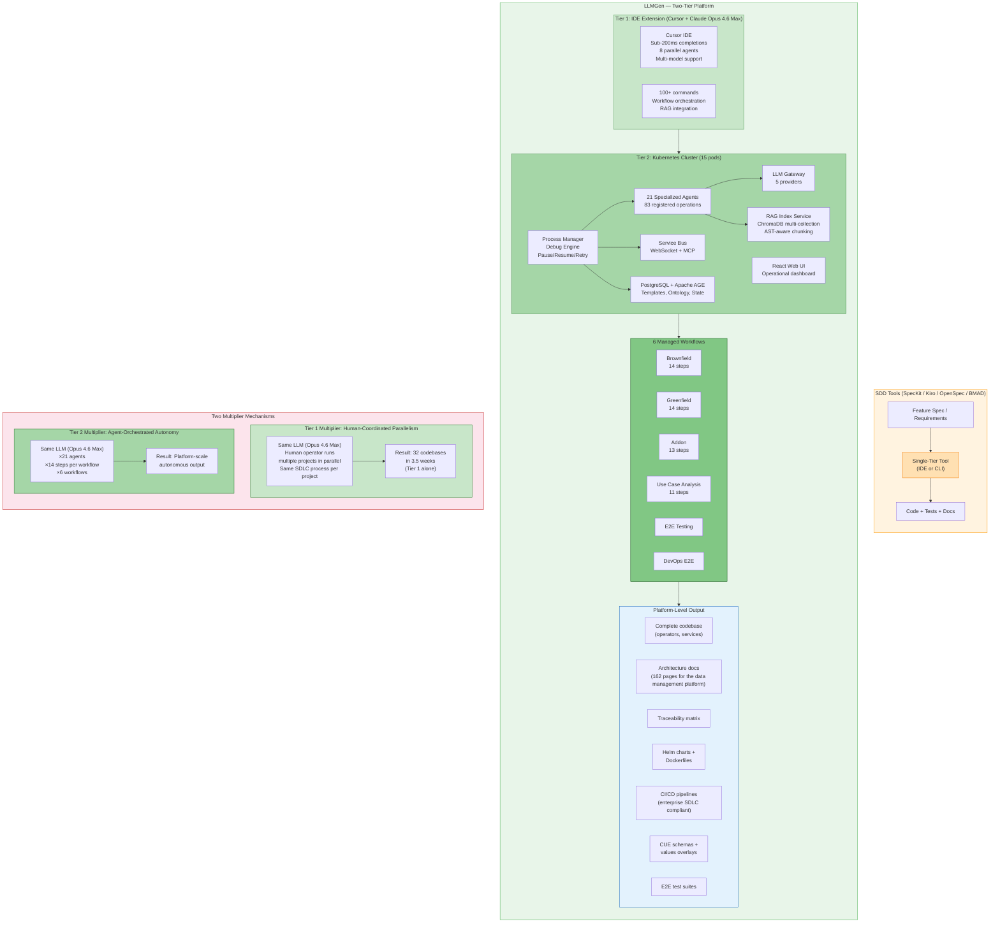
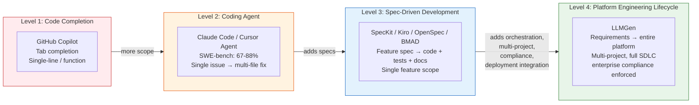
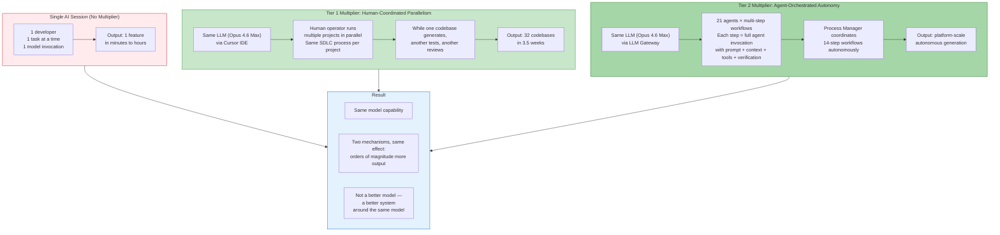

# LLMGen vs Spec-Driven Development Tools — Benchmark Analysis

**Version:** 1.0
**Date:** 2026-06-10
**Status:** Active

---

## 1. Executive Summary

The AI development tool landscape in 2026 has two established benchmark categories: **Coding Agent Benchmarks** (SWE-bench, TerminalBench) measuring single-issue resolution, and **Spec-Driven Development (SDD) Framework Benchmarks** measuring spec-to-feature workflows. Neither category captures what LLMGen does — LLMGen operates at the **platform engineering lifecycle level**, orchestrating multi-agent workflows that generate entire platforms with full SDLC compliance.

This document explains why direct benchmark comparison is not applicable and positions LLMGen's architecture against industry tools.

---

## 2. Industry Benchmark Landscape

### 2.1 Coding Agent Benchmarks (Single-Issue Resolution)

These measure: "Given a GitHub issue, produce a correct fix."
| Agent | SWE-bench Verified | TerminalBench 2.1 | Type |
|---|---|---|---|
| Claude Code (Opus 4.8) | 88.6% | 78.9% | Autonomous CLI |
| OpenAI Codex (GPT-5.5) | — | 83.4% | Autonomous CLI + IDE |
| Cursor (Sonnet 4.6) | ~67% | — | Pair-programming IDE |
| Aider (Sonnet 4.6) | ~63% | — | CLI pair-programming |
| Devin | ~58% | — | Autonomous multi-hour |
| Cline (Sonnet 4.6) | ~58% | — | VS Code autonomous |

**Sources:**
- [Presenc AI — Coding Agent Benchmarks 2026](https://presenc.ai/research/coding-agent-benchmarks-2026)
- [MorphLLM — Best AI Coding Agents 2026](https://www.morphllm.com/best-ai-coding-agents-2026)
- [RightAIChoice — AI Coding Leaderboard 2026](https://rightaichoice.com/blog/ai-coding-assistant-leaderboard-swe-bench-humaneval-2026)

### 2.2 Spec-Driven Development Framework Benchmarks

These measure: "Given a feature requirement, generate code with specs, docs, and tests."
| Framework | Score (RanTheBuilder) | Cost/Feature | Time to PR | Best For |
|---|---|---|---|---|
| OpenSpec | 4.00/5 | ~$95 | ~1 day | Brownfield delta changes |
| BMAD Quick | 3.74/5 | ~$75 | ~1 day | Small features |
| BMAD Full | 3.65/5 | ~$200 | ~6 days | Design-critical work |
| SpecKit | 2.77/5 | ~$75 | ~1 day | Greenfield standardization |

**Quality metrics (vunvulear/speckit-assessment):**
| Category | SpecKit | SpecKit+Extensions | BMAD |
|---|---|---|---|
| Code Quality (Pylint + Flake8) | 9.0 | 8.5 | 7.0 |
| Cognitive Complexity (Halstead) | 7.0 | 9.5 | 10.0 |
| Test Quality | 7.5 | 9.0 | 9.5 |
| Documentation | 5.0 | 9.5 | 6.5 |
| Test Coverage | 94.27% | 92.24% | 99.01% |
| **Weighted Total** | **7.13** | **8.93** | **8.05** |

**Sources:**
- [RanTheBuilder — I Tested Three Spec-Driven AI Tools](https://ranthebuilder.cloud/blog/i-tested-three-spec-driven-ai-tools-here-s-my-honest-take/)
- [vunvulear/speckit-assessment](https://github.com/vunvulear/speckit-assessment)
- [SoftwareSeni — The 30+ Framework Landscape](https://www.softwareseni.com/the-30-plus-framework-landscape-navigating-spec-driven-development-options-in-2026/)

### 2.3 IDE Benchmarks (Kiro vs Cursor)
| Dimension | Kiro (AWS) | Cursor |
|---|---|---|
| Time to first code | ~90s (spec generation) | ~15s |
| Total time to working feature | ~8 min | ~12 min (more iteration) |
| Files touched correctly first try | 95% | 70% |
| Architecture quality | High (designed upfront) | Medium (emerges from iteration) |
| Overall score (WeavAI) | 8.38/10 | 8.96/10 |

**Sources:**
- [Augment Code — Kiro vs Cursor 2026](https://www.augmentcode.com/tools/kiro-vs-cursor)
- [WeavAI — Amazon Kiro vs Cursor 2026](https://weavai.app/blog/en/2026/05/24/amazon-kiro-vs-cursor-2026-spec-driven-vs-ai-coding/)
- [MorphLLM — Kiro vs Cursor](https://www.morphllm.com/comparisons/kiro-vs-cursor)

---

## 3. Why LLMGen Operates at a Different Level

### 3.1 Scope Comparison
| Dimension | SWE-bench / SDD Tools | LLMGen |
|---|---|---|
| Scope | Single feature or GitHub issue | Entire platform (27 operators, 162 pages) |
| Workflow | Spec → code → tests | Requirements → analysis → design → code → tests → CI/CD → Helm → E2E → deployment |
| Output | Code files + tests | Complete deliverable with full SDLC compliance |
| Standards compliance | None measured | enterprise SDLC compliance standards, TM Forum |
| Brownfield | Delta changes (OpenSpec) | Full brownfield (14 steps) + addon (13 steps) + impact analysis |
| Multi-project | Not supported | Data mesh with sibling DPs, cross-dependencies |
| DevOps artifacts | Not generated | Helm charts, Dockerfiles, CI/CD pipelines |
| Deployment integration | None | ACM pipeline, Mesh Sizer, admission controller |
| Cross-artifact traceability | Spec → code only | Requirements → design → code → tests → CI/CD → deployment |

### 3.2 Architecture Comparison

### 3.3 Tool Category Positioning

---

## 4. LLMGen Two-Tier Architecture Detail

### 4.1 Tier 1 — IDE Extension (Interactive + Human-Coordinated Parallelism)

Built on Cursor IDE powered by Claude Opus 4.6 Max:

- Sub-200ms tab completions
- 8 parallel agents
- Multi-model support (Claude, GPT, Gemini)
- 100+ commands for workflow orchestration
- Local ChromaDB RAG with AST-aware chunking
- Direct integration with Tier 2 cluster

**Tier 1 Multiplier — Human-Coordinated Parallelism:**

Even without Tier 2, a human operator multiplies Tier 1 output by running multiple projects in parallel using the same SDLC process per project. While one codebase is being generated, another is being tested, another is being reviewed. The human coordinates across codebases; the AI does the heavy lifting per codebase.

This is how the the data management platform platform was produced: 32 codebases in 3.5 weeks using Tier 1 alone. The multiplication happens at the human operator level — not through additional tooling, but through disciplined parallel execution of the same process across multiple projects simultaneously.

### 4.2 Tier 2 — Kubernetes Cluster (Autonomous)

15-pod multi-agent orchestration platform:
| Component | Purpose |
|---|---|
| Process Manager | Orchestration + debug engine (pause/resume/retry/approval gates) |
| 21 Specialized Agents | 83 registered operations across analysis, design, codegen, testing, validation |
| Service Bus | WebSocket + MCP event pub/sub |
| LLM Gateway | 5 providers: Cursor API, Anthropic, OpenAI, Google AI, Ollama |
| RAG Index Service | ChromaDB multi-collection, AST-aware chunking, cross-index federated search |
| Database | PostgreSQL + Apache AGE (templates, ontology, state, dependency graph) |
| React Web UI | Full debug dashboard at :31000 |

### 4.3 Two Multiplier Mechanisms

**Key insight:** The 32 codebases in 3.5 weeks were achieved using Tier 1 alone — human-coordinated parallelism with the same SDLC process per project. Tier 2 adds autonomous agent orchestration on top of this, further multiplying output. Both mechanisms use the same underlying LLM; the difference is the system around it.

---

## 5. What Only LLMGen Does (No Benchmark Exists)
| Capability | LLMGen | SpecKit / Kiro / OpenSpec / Cursor |
|---|---|---|
| **Multi-project orchestration** | DP depends on DMP → generates both, tests E2E together | Single project only |
| **Brownfield + Addon SDLC** | Analyze existing codebase → generate addons → E2E test | OpenSpec: delta changes only |
| **Platform-level generation** | 32 codebases, 27 operators + 162 pages + traceability | Single feature/component |
| **Standards enforcement** | enterprise SDLC compliance as workspace rules, applied to every artifact | No compliance framework |
| **Cross-artifact traceability** | Requirements → design → code → tests → CI/CD → deployment | Spec → code only |
| **Shared context across developers** | RAG index, workspace rules, prompt templates shared across mesh | Per-developer context only |
| **Deployment pipeline integration** | Output feeds into ACM (Phase 3), Mesh Sizer (Phase 2) | No deployment awareness |
| **Template system with versioning** | process_templates → versions → parameters → step_configs → step_bindings | Fixed workflow per tool |
| **Debug-before-release** | Full step-by-step execution engine before templates go production | No equivalent |
| **DevOps artifact generation** | Helm charts, Dockerfiles, CI/CD pipelines as greenfield projects | Not generated |
| **Infrastructure component management** | Brownfield analysis of forked OSS (unvendored infrastructure forks) | Not supported |

---

## 6. Reference Data Points
| Metric | Value | Context |
|---|---|---|
| the data management platform platform generation | 3.5 weeks | 32 codebases, 27 operators, 162 architecture pages, full traceability |
| Multiplier mechanism | Tier 1: human-coordinated parallelism | 32 codebases achieved with Tier 1 alone; Tier 2 adds autonomous orchestration |
| Agents | 21 specialized | 83 registered operations, versioned with step_configs |
| Workflows | 6 managed processes | Brownfield (14), Greenfield (14), Addon (13), Use Case (11), E2E, DevOps E2E |
| LLM Model | Claude Opus 4.6 Max | Same Opus family that leads SWE-bench at 88.6% (Opus 4.8) |
| Tier 2 cluster | 15 pods | Full autonomous orchestration platform |
| Standards compliance | enterprise SDLC compliance standards, TM Forum | Enforced via workspace rules on every generated artifact |
| Peer comparison | None | No other tool has attempted platform-level generation at this scope |

---

## 7. Benchmark Gap — What Would Be Needed

To benchmark LLMGen against industry tools, a **platform-level benchmark** would need to be defined:

> "Given a set of requirements, generate a complete platform with N operators, architecture docs, tests, CI/CD pipelines, Helm charts, and deployment artifacts — measured by artifact completeness, standards compliance, test coverage, and time to production readiness."

No such benchmark exists in the industry today because no other tool claims to operate at this scope.

---

## 8. Sources
| Source | URL | Date |
|---|---|---|
| Presenc AI — Coding Agent Benchmarks 2026 | https://presenc.ai/research/coding-agent-benchmarks-2026 | 2026 |
| MorphLLM — Best AI Coding Agents 2026 | https://www.morphllm.com/best-ai-coding-agents-2026 | 2026 |
| RightAIChoice — AI Coding Leaderboard 2026 | https://rightaichoice.com/blog/ai-coding-assistant-leaderboard-swe-bench-humaneval-2026 | 2026 |
| RanTheBuilder — SDD Tools Benchmark | https://ranthebuilder.cloud/blog/i-tested-three-spec-driven-ai-tools-here-s-my-honest-take/ | Feb 2026 |
| vunvulear/speckit-assessment | https://github.com/vunvulear/speckit-assessment | 2026 |
| SoftwareSeni — 30+ Framework Landscape | https://www.softwareseni.com/the-30-plus-framework-landscape-navigating-spec-driven-development-options-in-2026/ | 2026 |
| cameronsjo/spec-compare | https://github.com/cameronsjo/spec-compare | 2026 |
| Augment Code — Kiro vs Cursor | https://www.augmentcode.com/tools/kiro-vs-cursor | 2026 |
| WeavAI — Kiro vs Cursor | https://weavai.app/blog/en/2026/05/24/amazon-kiro-vs-cursor-2026-spec-driven-vs-ai-coding/ | May 2026 |
| MorphLLM — Kiro vs Cursor | https://www.morphllm.com/comparisons/kiro-vs-cursor | 2026 |
| Rapid Dev — AI Code Editor Comparison 2026 | https://www.rapidevelopers.com/blog/cursor-vs-copilot-windsurf-and-claude-code-ai-code-editor-comparison-2026 | 2026 |
| AgentMarketCap — Coding Agents Compared | https://agentmarketcap.ai/blog/2026/04/05/coding-agents-compared-claude-code-cursor-windsurf-devin | Apr 2026 |

---

*LLMGen vs SDD Tools — Benchmark Analysis — Version 1.0 — 2026-06-10*
